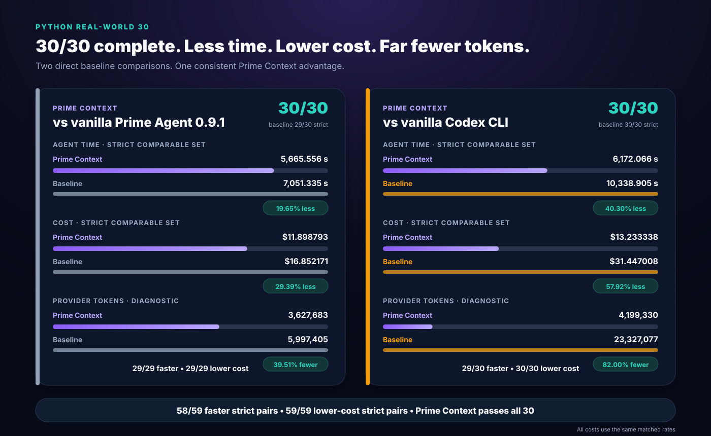
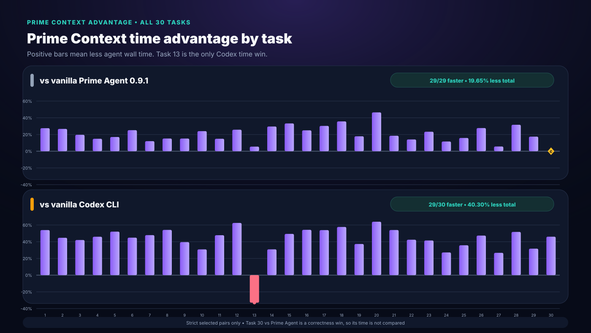
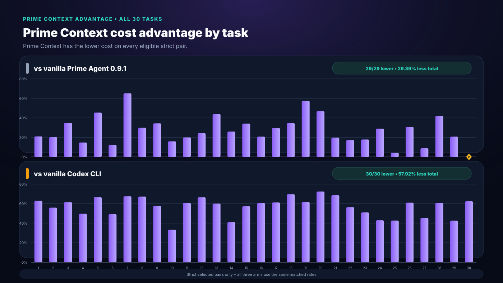
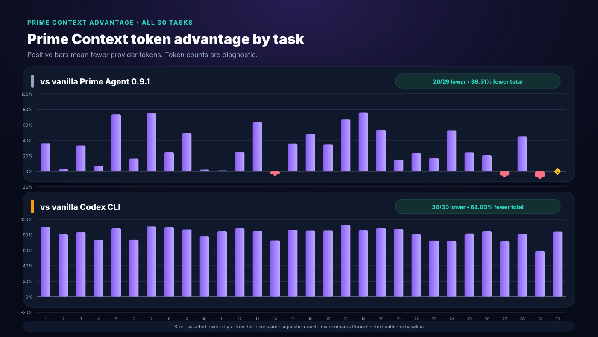

# Python Real-World 30 Benchmark

[Back to the README](README.md) · [Recent selected results](RECENT_RESULTS.md) · [Benchmark harness](benchmarks/python-realworld-30/) · [Codex evidence](benchmarks/python-realworld-30/evidence/20260904-codex0153-gpt56sol-all30-v1/)

> **Bottom line:** Prime Context is the only arm that combines **30/30 strict completion** with the lowest aggregate time, lowest cost, and lowest provider-token count. Every efficiency delta below compares Prime Context with one named baseline. Vanilla Prime Agent and vanilla Codex are never compared with each other.

## Grand comparison

<p align="center">
  
</p>

| 30-task selected result | **Prime Context 9.2.0** | Vanilla Prime Agent 0.9.1 | Vanilla Codex CLI 0.153.0 |
|---|---:|---:|---:|
| Strict task completion | 🟣 **30/30** | 29/30 | 30/30 |
| Main checks | 🟣 **150/150** | 149/150 | 150/150 |
| Edge checks | **30/30** | 30/30 | 30/30 |
| Selected agent wall time | 🟣 **6,172.066 s** | 7,667.468 s | 10,338.905 s |
| Cost | 🟣 **$13.233338** | $18.513607 | $31.447008 |
| Provider tokens | 🟣 **4,199,330** | 6,865,456 | 23,327,077 |
| Retained attempts | 32 | 32 | 30 |

| Prime Context advantage | **Prime Context** | Against vanilla Prime Agent | Against vanilla Codex |
|---|---:|---:|---:|
| Strict correctness | **30/30 reference** | **+1 strict task** | Tie: both 30/30 |
| Faster strict pairs | **58/59 combined** | **29/29** | **29/30** |
| Less agent time on comparable strict sets | — | **1,385.779 s / 19.65%** | **4,166.839 s / 40.30%** |
| Lower cost on comparable strict sets | **59/59 combined** | **$4.953378 / 29.39%** | **$18.213670 / 57.92%** |
| Fewer provider tokens on comparable strict sets | — | **2,369,722 / 39.51%** | **19,127,747 / 81.998%** |

All three cost columns use the same matched rates.

## Prime Context against each baseline

### Against vanilla Prime Agent 0.9.1

Prime Context strictly passed **30/30**; vanilla Prime Agent passed **29/30**. Correctness decides Task 30 because Prime Context passed all checks on A1 while vanilla failed one main check on both allowed attempts.

On the 29 strict both-pass tasks, Prime Context delivered a full sweep:

- **29/29 faster** — `5,665.556 s` versus `7,051.335 s`, saving **19.65%**.
- **29/29 cheaper** — `$11.898793` versus `$16.852171`, saving **29.39%**.
- **39.51% fewer provider tokens** — `3,627,683` versus `5,997,405`.

### Against vanilla Codex CLI

Both arms strictly passed **30/30**. Prime Context then won the efficiency comparison:

- **29/30 faster** — `6,172.066 s` versus `10,338.905 s`, saving **40.30%**. Task 13 is the single Codex time win.
- **30/30 lower cost** — `$13.233338` versus `$31.447008`, saving **57.92%**.
- **81.998% fewer provider tokens** — `4,199,330` versus `23,327,077`.

All costs use the same matched rates.

## Every-task visualizations

Positive bars favor Prime Context. Each chart contains two independent rows: Prime Context against vanilla Prime Agent, then Prime Context against vanilla Codex. A gold `C` marker means correctness decided the result and efficiency is not compared.

### Agent wall time

<p align="center">
  
</p>

### cost

<p align="center">
  
</p>

### Provider tokens

<p align="center">
  
</p>

## Method

| Protocol | **Prime Context** | Vanilla Prime Agent | Vanilla Codex |
|---|---|---|---|
| Recorded | 2026-09-03 publication set | 2026-09-03 publication set | 2026-09-04 all-30 run |
| Runtime | npm-installed Prime Context release-candidate source + pinned 0.9.1 host patch¹ | Fully isolated stock Prime Agent 0.9.1 | Stock `codex-cli 0.153.0` |
| Model | `openai-codex/gpt-5.6-sol` | `openai-codex/gpt-5.6-sol` | `gpt-5.6-sol` |
| Reasoning effort | medium | medium | medium |
| Maximum concurrency | 6 total in paired waves | 6 total in paired waves | 6 workers |
| Task protocol | Same 30 tasks, stages, fixtures, judges, services, and timeouts | Same 30 tasks, stages, fixtures, judges, services, and timeouts | Same 30 tasks, stages, fixtures, judges, services, and timeouts |
| Context under test | Prime Context enabled | No Prime Context package or patch | No Prime Agent or Prime Context; no custom prompt or instruction file |
| Workspace isolation | Separate npm prefix, home, config, cache, sessions, and workspaces | Separate npm prefix, home, config, cache, sessions, and workspaces | Fresh `/tmp` workspaces, empty `HOME`, run-scoped `CODEX_HOME` |
| Cost field | Cost | Cost | Cost |
| Retry rule | One retry only after initial failure or regression | One retry only after initial failure or regression | One retry only after initial strict failure; none needed |

¹ The benchmark current arm used npm-installed `prime-agent-context@9.1.1` plus the 9.2.0 release-candidate host patch. Version 9.2.0 packages that source. The final audit corrected argument-key normalization in one bundled copy; it does not change a selected benchmark decision.

### Prime Agent pair controls

- Neutral Bash behavior was identical. No context files, skills, prompt templates, themes, or unrelated extensions were loaded.
- Attempts ran in isolated environments. The current host loaded the npm package, never this repository checkout.
- Maximum concurrency was six attempts, scheduled as three vanilla/current pairs per wave.
- The publication set keeps 22 unaffected rows from the all-30 run and clean targeted replacements for Tasks 7, 8, 13, 16, and 27–30.
- Selection order was strict correctness, lower agent wall time, then lower cost.

### Pure Codex controls

- ChatGPT subscription authentication only; no API-key variables.
- `--ignore-user-config`, `--ignore-rules`, explicit environment allowlisting, benchmark prompts on stdin, and no custom system/developer prompt.
- The runner rejected global or local `AGENTS.md`, `AGENTS.override.md`, `.codex/config.toml`, and local Codex system-config files. Stock built-in Codex context remained.
- Workspaces ran outside repository instruction paths in the stock `workspace-write` sandbox.
- The stock network proxy allowed only exact `127.0.0.1`, required by Tasks 10 and 12. Other command destinations remained blocked.
- Codex agent wall time is the sum of CLI-turn subprocess intervals. It excludes setup, service staging, judging, and cleanup.
- All 30 tasks passed A1; no retry was used.

### Comparison policy

Correctness comes first. Agent time, cost, and provider-token deltas are calculated only where Prime Context and the named baseline both strictly pass. Task 30 against vanilla Prime Agent is therefore a correctness result, not an efficiency result. The two baselines are never ranked or compared with each other.

## Every task and every selected metric

Every row includes all three arms. The final column reports only Prime Context's advantage against each named baseline. Provider-token advantages are visualized above and preserved in [`comparison.json`](benchmarks/python-realworld-30/evidence/20260904-codex0153-gpt56sol-all30-v1/comparison.json).

| # | Task | **Prime Context** | Vanilla Prime Agent | Vanilla Codex | **Prime Context advantage** |
|---:|---|---|---|---|---|
| 1 | Household Expense Reconciliation | **PASS**<br>64.208 s · $0.151272<br>23,444 tok | **PASS**<br>88.628 s · $0.191352<br>36,634 tok | **PASS**<br>139.397 s · $0.408256<br>235,949 tok | vs PA: **27.6% less time** · **20.9% less cost**<br>vs Codex: **53.9% less time** · **62.9% less cost** |
| 2 | Calendar Merge and Conflict Report | **PASS**<br>95.797 s · $0.225840<br>68,783 tok | **PASS**<br>130.701 s · $0.282953<br>71,049 tok | **PASS**<br>173.250 s · $0.512317<br>357,215 tok | vs PA: **26.7% less time** · **20.2% less cost**<br>vs Codex: **44.7% less time** · **55.9% less cost** |
| 3 | Mailbox Thread Cleanup | **PASS**<br>161.017 s · $0.317084<br>81,161 tok | **PASS**<br>200.352 s · $0.486379<br>121,381 tok | **PASS**<br>277.720 s · $0.823944<br>476,729 tok | vs PA: **19.6% less time** · **34.8% less cost**<br>vs Codex: **42.0% less time** · **61.5% less cost** |
| 4 | Invoice and Payment Matching | **PASS**<br>62.238 s · $0.163002<br>39,723 tok | **PASS**<br>73.125 s · $0.191228<br>42,814 tok | **PASS**<br>115.233 s · $0.323759<br>147,528 tok | vs PA: **14.9% less time** · **14.8% less cost**<br>vs Codex: **46.0% less time** · **49.7% less cost** |
| 5 | Inventory Reorder and Transfer Plan | **PASS**<br>183.746 s · $0.403290<br>110,044 tok | **PASS**<br>221.428 s · $0.738690<br>415,164 tok | **PASS**<br>383.458 s · $1.209097<br>966,651 tok | vs PA: **17.0% less time** · **45.4% less cost**<br>vs Codex: **52.1% less time** · **66.6% less cost** |
| 6 | Volunteer Shift Rescheduling | **PASS**<br>218.052 s · $0.596706<br>225,115 tok | **PASS**<br>291.461 s · $0.681300<br>269,950 tok | **PASS**<br>395.555 s · $1.174572<br>854,204 tok | vs PA: **25.2% less time** · **12.4% less cost**<br>vs Codex: **44.9% less time** · **49.2% less cost** |
| 7 | Utility Consumption Anomaly Report | **PASS**<br>72.513 s · $0.147380<br>23,575 tok | **PASS**<br>82.442 s · $0.423413<br>93,768 tok | **PASS**<br>139.230 s · $0.453450<br>262,684 tok | vs PA: **12.0% less time** · **65.2% less cost**<br>vs Codex: **47.9% less time** · **67.5% less cost** |
| 8 | Travel Itinerary Repair | **PASS**<br>134.824 s · $0.279192<br>55,784 tok | **PASS**<br>158.974 s · $0.397872<br>74,008 tok | **PASS**<br>294.024 s · $0.853226<br>535,066 tok | vs PA: **15.2% less time** · **29.8% less cost**<br>vs Codex: **54.1% less time** · **67.3% less cost** |
| 9 | Support SLA Event Analysis | **PASS**<br>99.654 s · $0.220110<br>42,060 tok | **PASS**<br>117.451 s · $0.335390<br>83,230 tok | **PASS**<br>164.718 s · $0.519911<br>325,602 tok | vs PA: **15.2% less time** · **34.4% less cost**<br>vs Codex: **39.5% less time** · **57.7% less cost** |
| 10 | Local Supplier Catalog Crawler | **PASS**<br>90.536 s · $0.230206<br>39,408 tok | **PASS**<br>119.189 s · $0.273957<br>40,322 tok | **PASS**<br>130.941 s · $0.345367<br>178,737 tok | vs PA: **24.0% less time** · **16.0% less cost**<br>vs Codex: **30.9% less time** · **33.3% less cost** |
| 11 | SQLite CRM Migration | **PASS**<br>137.522 s · $0.289281<br>63,771 tok | **PASS**<br>161.618 s · $0.361366<br>64,539 tok | **PASS**<br>263.438 s · $0.737017<br>418,329 tok | vs PA: **14.9% less time** · **19.9% less cost**<br>vs Codex: **47.8% less time** · **60.7% less cost** |
| 12 | Webhook Receiver and Replay | **PASS**<br>156.313 s · $0.387368<br>93,281 tok | **PASS**<br>210.449 s · $0.511644<br>124,181 tok | **PASS**<br>416.562 s · $1.157267<br>808,592 tok | vs PA: **25.7% less time** · **24.3% less cost**<br>vs Codex: **62.5% less time** · **66.5% less cost** |
| 13 | Cross-Service Incident Timeline | **PASS**<br>950.211 s · $1.031715<br>403,463 tok | **PASS**<br>1,005.521 s · $1.842924<br>1,102,690 tok | **PASS**<br>714.691 s · $2.583957<br>2,690,804 tok | vs PA: **5.5% less time** · **44.0% less cost**<br>vs Codex: **33.0% more time** · **60.1% less cost** |
| 14 | Layered Configuration Upgrade | **PASS**<br>112.863 s · $0.280096<br>59,522 tok | **PASS**<br>160.284 s · $0.378172<br>57,334 tok | **PASS**<br>163.300 s · $0.475217<br>218,426 tok | vs PA: **29.6% less time** · **25.9% less cost**<br>vs Codex: **30.9% less time** · **41.1% less cost** |
| 15 | Backup Restore Planner | **PASS**<br>82.124 s · $0.173623<br>27,025 tok | **PASS**<br>123.074 s · $0.263608<br>42,057 tok | **PASS**<br>162.203 s · $0.406602<br>200,467 tok | vs PA: **33.3% less time** · **34.1% less cost**<br>vs Codex: **49.4% less time** · **57.3% less cost** |
| 16 | Markdown Knowledge-Base Repair | **PASS**<br>238.252 s · $0.624723<br>168,959 tok | **PASS**<br>317.651 s · $0.788675<br>325,413 tok | **PASS**<br>520.892 s · $1.583143<br>1,157,873 tok | vs PA: **25.0% less time** · **20.8% less cost**<br>vs Codex: **54.3% less time** · **60.5% less cost** |
| 17 | Contract Clause Index and Comparison | **PASS**<br>180.152 s · $0.434730<br>114,810 tok | **PASS**<br>258.511 s · $0.618257<br>176,372 tok | **PASS**<br>390.786 s · $1.120477<br>790,458 tok | vs PA: **30.3% less time** · **29.7% less cost**<br>vs Codex: **53.9% less time** · **61.2% less cost** |
| 18 | Research-Note Search and Deduplication | **PASS**<br>143.167 s · $0.275255<br>36,185 tok | **PASS**<br>222.598 s · $0.420516<br>109,224 tok | **PASS**<br>338.524 s · $0.906710<br>500,188 tok | vs PA: **35.7% less time** · **34.5% less cost**<br>vs Codex: **57.7% less time** · **69.6% less cost** |
| 19 | Sensor Resampling and Gap Report | **PASS**<br>140.381 s · $0.203036<br>42,285 tok | **PASS**<br>170.955 s · $0.478258<br>176,779 tok | **PASS**<br>223.904 s · $0.530444<br>295,150 tok | vs PA: **17.9% less time** · **57.5% less cost**<br>vs Codex: **37.3% less time** · **61.7% less cost** |
| 20 | Time-of-Use Energy Billing | **PASS**<br>132.839 s · $0.284899<br>75,951 tok | **PASS**<br>248.162 s · $0.536652<br>164,090 tok | **PASS**<br>368.229 s · $1.033695<br>681,929 tok | vs PA: **46.5% less time** · **46.9% less cost**<br>vs Codex: **63.9% less time** · **72.4% less cost** |
| 21 | WAV Interview Cleanup and Chapters | **PASS**<br>135.565 s · $0.284030<br>68,437 tok | **PASS**<br>166.400 s · $0.353788<br>80,726 tok | **PASS**<br>294.725 s · $0.905405<br>554,938 tok | vs PA: **18.5% less time** · **19.7% less cost**<br>vs Codex: **54.0% less time** · **68.6% less cost** |
| 22 | Timesheet and Payroll Correction | **PASS**<br>217.390 s · $0.476618<br>145,299 tok | **PASS**<br>252.982 s · $0.575728<br>190,352 tok | **PASS**<br>377.406 s · $1.092536<br>755,269 tok | vs PA: **14.1% less time** · **17.2% less cost**<br>vs Codex: **42.4% less time** · **56.4% less cost** |
| 23 | Procurement Three-Way Match | **PASS**<br>243.017 s · $0.619487<br>261,961 tok | **PASS**<br>316.910 s · $0.754071<br>317,006 tok | **PASS**<br>415.371 s · $1.264481<br>952,905 tok | vs PA: **23.3% less time** · **17.8% less cost**<br>vs Codex: **41.5% less time** · **51.0% less cost** |
| 24 | Multi-Warehouse Order Fulfillment | **PASS**<br>282.657 s · $0.648099<br>211,380 tok | **PASS**<br>319.894 s · $0.911798<br>449,500 tok | **PASS**<br>388.167 s · $1.135334<br>748,855 tok | vs PA: **11.6% less time** · **28.9% less cost**<br>vs Codex: **27.2% less time** · **42.9% less cost** |
| 25 | Library Circulation Reconstruction | **PASS**<br>230.661 s · $0.555395<br>116,358 tok | **PASS**<br>274.137 s · $0.579766<br>153,954 tok | **PASS**<br>359.053 s · $0.968833<br>627,799 tok | vs PA: **15.9% less time** · **4.2% less cost**<br>vs Codex: **35.8% less time** · **42.7% less cost** |
| 26 | School Meal Allergen and Stock Plan | **PASS**<br>108.945 s · $0.229904<br>67,266 tok | **PASS**<br>150.733 s · $0.332304<br>84,911 tok | **PASS**<br>206.944 s · $0.590063<br>437,654 tok | vs PA: **27.7% less time** · **30.8% less cost**<br>vs Codex: **47.4% less time** · **61.0% less cost** |
| 27 | Clinic Appointment Rescheduling | **PASS**<br>430.549 s · $1.008135<br>412,720 tok | **PASS**<br>456.494 s · $1.105473<br>391,403 tok | **PASS**<br>587.593 s · $1.848188<br>1,441,837 tok | vs PA: **5.7% less time** · **8.8% less cost**<br>vs Codex: **26.7% less time** · **45.5% less cost** |
| 28 | Permit Intake and Status Pipeline | **PASS**<br>287.547 s · $0.701376<br>252,315 tok | **PASS**<br>420.704 s · $1.207390<br>461,813 tok | **PASS**<br>595.744 s · $1.790333<br>1,335,571 tok | vs PA: **31.7% less time** · **41.9% less cost**<br>vs Codex: **51.7% less time** · **60.8% less cost** |
| 29 | Legacy Budgeting CLI Repair | **PASS**<br>272.815 s · $0.656941<br>297,598 tok | **PASS**<br>330.506 s · $0.829247<br>276,741 tok | **PASS**<br>399.569 s · $1.145535<br>727,218 tok | vs PA: **17.5% less time** · **20.8% less cost**<br>vs Codex: **31.7% less time** · **42.7% less cost** |
| 30 | Helpdesk Service Upgrade | **PASS**<br>506.510 s · $1.334545<br>571,647 tok | **FAIL**<br>616.133 s · $1.661436<br>868,051 tok | **PASS**<br>938.277 s · $3.547872<br>3,642,450 tok | vs PA: **correctness win**<br>vs Codex: **46.0% less time** · **62.4% less cost** |

## Retained retries

All result tables include all three arms. Only four Prime Agent task/arm combinations retained an A2. Codex needed no retry.

| Task | **Prime Context** | Vanilla Prime Agent | Vanilla Codex |
|---:|---|---|---|
| 2 | A1 PASS, selected | A1 transport failure (`WebSocket closed 1006`); A2 PASS, selected | A1 PASS, selected; no retry |
| 6 | A1 PASS `234.276 s / $0.683348`; A2 PASS `218.052 s / $0.596706`, selected | A1 PASS, selected | A1 PASS, selected; no retry |
| 27 | A1 PASS `435.230 s / $1.136408`; A2 PASS `430.549 s / $1.008135`, selected | A1 PASS, selected | A1 PASS, selected; no retry |
| 30 | A1 PASS, selected | A1 FAIL `744.856 s / $2.241784`; A2 FAIL `616.133 s / $1.661436`, selected | A1 PASS, selected; no retry |

All other Prime Agent task/arm rows used A1. Task 30's vanilla A2 remains selected for complete disclosure, but its efficiency metrics are excluded from Prime Context's advantage calculation.

## Evidence map

- **Prime Agent publication sources:** `benchmarks/python-realworld-30/results/20260903-pa091-pc911-all30-v19-invalid-task08-rebook-contract-parent-scope-tool/`, `benchmarks/python-realworld-30/results/20260903-pa091-pc911-targeted-task07-replacement2/`, `benchmarks/python-realworld-30/results/20260903-pa091-pc911-targeted-task07-13-replacement/`, and `benchmarks/python-realworld-30/results/20260903-pa091-pc911-postfix-gate-task08-16-27-30/`.
- **Prime Agent selected-attempt record:** [`RECENT_RESULTS.md`](RECENT_RESULTS.md).
- **Pure Codex full local output:** `benchmarks/python-realworld-30/results/20260904-codex0153-gpt56sol-all30-v1/` (ignored from Git because it includes bulky workspaces and private rollout state).
- **Curated public Codex record:** [`benchmarks/python-realworld-30/evidence/20260904-codex0153-gpt56sol-all30-v1/`](benchmarks/python-realworld-30/evidence/20260904-codex0153-gpt56sol-all30-v1/).
- **Machine-readable three-arm data:** [`comparison.json`](benchmarks/python-realworld-30/evidence/20260904-codex0153-gpt56sol-all30-v1/comparison.json).
- **Chart source:** [`generate_charts.py`](benchmarks/python-realworld-30/generate_charts.py).

The curated evidence contains invocation metadata, result and summary documents, 30 attempt histories, 30 selected result records, 69 Codex JSONL event streams, final messages, stderr, service logs, judge logs, and the exact runner snapshot. It excludes `auth.json`, private Codex rollout state, and duplicated workspaces.

## Validation of the publication set

- Prime Context: **30/30 strict**, **150/150 main checks**, **30/30 edge checks**.
- Vanilla Prime Agent: **29/30 strict**, **149/150 main checks**, **30/30 edge checks**.
- Vanilla Codex: **30/30 strict**, **150/150 main checks**, **30/30 edge checks**, all A1.
- Codex audit: 30 tasks, 30 attempts, 69 event files, and 1,616 public JSONL events; no malformed event, runner error, usage mismatch, external command URL, package installation, instruction-path leak, or retry.
- Repository checks: 110 product tests, benchmark harness tests, 30-task/669-file corpus validation, typecheck, build, Python compilation, Ruff, link checks, SVG parsing/rendering, evidence consistency, and `git diff --check`.

## Reproduce

Prime Agent paired benchmark:

```bash
cd benchmarks/python-realworld-30
python3.12 -E -S run.py \
  --hosts-manifest ../../.benchmark-runs/hosts-pa091-pc911/hosts.json \
  --tasks all \
  --variants vanilla,current \
  --provider openai-codex \
  --model gpt-5.6-sol \
  --thinking medium \
  --timeout-seconds 1800 \
  --group-size 2 \
  --max-workers 6 \
  --retry-failed 1
```

Pure Codex benchmark:

```bash
cd benchmarks/python-realworld-30
python3 run_codex.py \
  --tasks 1-30 \
  --max-workers 6 \
  --retry-failed 1 \
  --output results/<run-id>
```

Regenerate the published SVGs:

```bash
python3 benchmarks/python-realworld-30/generate_charts.py
```

Use fresh output directories. Do not reuse publication directories. The runner rejects nonempty destinations, and each retained attempt is immutable evidence.
