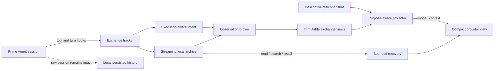

<div align="center">

# Prime Context

**Purpose-aware context management for long-running Prime Agent sessions.**

Keep the complete local transcript. Send the model only the context it can use.

[](https://www.npmjs.com/package/prime-agent-context)
[](https://github.com/PrimeIntellect-ai/prime-agent)
[](https://nodejs.org/)
[](LICENSE)

[Install](#quick-start) · [How it works](#how-it-works) · [Benchmark](#interim-910-benchmark-evidence) · [Commands](#commands) · [Configuration](#configuration)

</div>

---

Prime Context is a local extension for [Prime Agent](https://github.com/PrimeIntellect-ai/prime-agent). It prevents large tool results, repeated reads, traces, generated files, and long-running workflow state from crowding out the task itself.

It does this without rewriting the persisted session:

- **raw messages remain available locally;**
- **large observations are archived and replaced only in the provider-facing view;**
- **important failures, test results, source locations, and task state stay visible;**
- **exact evidence can be recovered on demand;**
- **stable projections improve prompt locality instead of changing on every turn.**

> [!NOTE]
> **Prime Context 9.1.1 is an interim, usable release of a major runtime upgrade.** It is ready for real work on the pinned Prime Agent 0.9.1 host, while the new hermetic benchmark and its reference points continue to mature. Scores from the retired benchmark are retained as historical evidence, but they are not comparable with the new protocol.

> [!WARNING]
> **Full Prime Context 9.1.1 requires the version-pinned Prime Agent 0.9.1 host patch included in this repository.** Stock Prime Agent 0.9.1 does not yet emit the purpose-aware `model_context`, awaited hidden `turn_end` messages, and execution-mode metadata required by the finalized-exchange projection pipeline. The patch is idempotent and fails closed on any unsupported host version. [Install the host contract](#quick-start).

> [!IMPORTANT]
> Prime Context 9.1.1 also appends its bundled **no-verification-theater / KISS policy** to Prime Agent's assembled system prompt. It applies without an `AGENTS.md` file and remains active across ordinary runs, autonomous continuations, and compaction. [Read the policy](#global-system-prompt-policy).

<div align="center">

| **10/12** strict passes | **-49.6%** tokens | **-31.7%** time | **-31.8%** cost |
|:---:|:---:|:---:|:---:|
| vs **9/12** on local 8.1.1 | matched strict pairs | matched strict pairs | matched strict pairs |

_One frozen random sample, `gpt-5.6-sol`, medium effort, isolated old and new hosts. Across all retained attempts, 9.1.0 also used 36.0% fewer tokens, 27.4% less agent time, and 26.4% less cost. The analyzer found no significant correctness or efficiency regression. [Read the interim benchmark report](benchmarks/RELEASE-9.1.0.md)._

</div>

## Why Prime Context?

Long agent sessions fail in predictable ways:

| Problem | Prime Context response |
|---|---|
| A command emits megabytes of logs | Stream the result into a local archive and show a bounded decision-focused capsule. |
| The model rereads the same file or test output | Show what changed, or mark the repeated section as unchanged. |
| Compaction hides requirements or current progress | Persist a compact task anchor, workflow state, open items, and relevant evidence. |
| An image or typed result is too large to keep replaying | Show supported media once, then retain a recoverable descriptor. |
| A later turn needs exact old output | Recover bounded pages with the `prime_context` tool or `/pc` commands. |
| Repeated context reshaping destroys cache locality | Freeze completed exchanges and reuse a stable provider projection generation. |
| Direct REPL writes or native `bash()` calls make validation stale | Detect Python file writes and shell mutations, advance the workspace revision, and require current evidence. |

Prime Context is not a second agent, a remote memory service, or a transcript database. It is a local context layer that operates at Prime Agent's extension hooks.

## Quick start

### Requirements

- Prime Agent **0.9.1**
- Node.js **22.8.0 or newer**
- write access to the installed Prime Agent package for the compatibility patch

### 1. Install Prime Context from npm

Prime Context pins the Prime Agent 0.9.1 runtime through its upstream release tarball because matching registry packages are not published. npm's `allowScripts` policy identifies that dependency by the exact tarball URL, not by the package name shown in npm's generated advice. Use this one-command policy so the reviewed dependency scripts run without the misleading repeated warning:

```bash
NPM_CONFIG_ALLOW_SCRIPTS='https://github.com/PrimeIntellect-ai/prime-agent/releases/download/v0.9.1/prime-agent-0.9.1.tgz,@google/genai,koffi,protobufjs' \
  prime-agent package install npm:prime-agent-context@9.1.1
```

The policy applies only to this command and does not change your user npm configuration. In particular, replacing the tarball URL with `@earendil-works/pi-coding-agent` does not work: npm matches remote tarball dependencies by resolved URL.

### 2. Install the Prime Agent host contract

The patch command is installed with Prime Context. Run it only after step 1:

```bash
prime-context-patch-agent --check-stock "$(npm root -g)/prime-agent"
prime-context-patch-agent "$(npm root -g)/prime-agent"
prime-context-patch-agent --check "$(npm root -g)/prime-agent"
```

The first command verifies the complete stock host contract without writing. The patcher then validates every planned transformation before it writes any file; the final command verifies the patched contract. It accepts only `prime-agent@0.9.1`, is idempotent, and stops instead of guessing when the host differs. The host patch does not run automatically during package installation. Reinstalling or updating Prime Agent can overwrite the patch, in which case rerun all three commands.

Start a new Prime Agent session. Prime Context is enabled by default.

Check it:

```text
/pc doctor
/pc status
```

Pinned package sources are intentionally not auto-updated by Prime Agent 0.9.1. To upgrade an older installation to this release, replace its configured package and then rerun the idempotent patch and final check:

```bash
prime-agent package remove npm:prime-agent-context
NPM_CONFIG_ALLOW_SCRIPTS='https://github.com/PrimeIntellect-ai/prime-agent/releases/download/v0.9.1/prime-agent-0.9.1.tgz,@google/genai,koffi,protobufjs' \
  prime-agent package install npm:prime-agent-context@9.1.1
prime-context-patch-agent "$(npm root -g)/prime-agent"
prime-context-patch-agent --check "$(npm root -g)/prime-agent"
```

### Install the extension from source instead

Register the built source package first. A local source registration does not globally link the packaged command, so invoke its repository script directly afterward:

```bash
npm ci
npm run build
prime-agent package install "$PWD"
node scripts/patch-prime-agent.mjs --check-stock "$(npm root -g)/prime-agent"
node scripts/patch-prime-agent.mjs "$(npm root -g)/prime-agent"
node scripts/patch-prime-agent.mjs --check "$(npm root -g)/prime-agent"
```

For one local run without installing the extension globally:

```bash
prime-agent -e "$PWD"
```

## How it works



### 1. Observe execution, not just command text

Prime Context listens to Prime Agent's public session, model, turn, tool, compaction, and tree hooks. It records the actual tool name, arguments, result shape, completion order, workspace mutation, validation identity, and outcome.

Parallel tools are admitted in assistant source order after their results are complete. Direct persistent-REPL filesystem writes, native `bash()` mutations, and edit tools advance a workspace revision so old validation cannot be treated as current.

### 2. Archive large observations

Short, novel, decision-useful output passes through. Large or repetitive output is streamed into a local session archive and represented by a bounded capsule. The archive keeps exact bytes and multipart metadata without forcing the model to reread them every turn.

The broker uses three main forms:

1. **Pass-through** for compact useful output.
2. **Structured capsule** for large or repetitive output, retaining decisive failures, test summaries, exception messages, source locations, and command state.
3. **Delta capsule** for repeated reads and changed documents, preserving the novel section while marking stable regions as unchanged.

A large result becomes something like:

```text
<prime_context_output id="obs_01..." tool="ipython" bytes="118442" lines="2638">
Archived; excerpt incomplete.
L1: ...
L2: ...
...
Read: prime_context action=read id=obs_01... startLine=120 endLine=180
Search: prime_context action=search id=obs_01... query="AssertionError"
</prime_context_output>
```

### 3. Project a provider-specific view

Raw session entries are not rewritten. Immediately before a provider request, Prime Context builds a temporary purpose-aware view:

- finalized exchanges use one installed fixed view;
- unchanged entry prefixes reuse the same projection only within the same semantic epoch;
- recovered text and supported images remain literal persistent evidence;
- sparse task updates stay near the prompt tail;
- Prime Agent owns compaction summaries and tree summaries;
- the patched host caches the next-request total across the effective system prompt, active tools, and the identical `budget` projection.

This separation keeps persistence faithful while letting model context remain compact and cache-friendly. Prime Context does not generate lossy history folds.

### 4. Preserve the task through long sessions

Prime Context stores a bounded descriptive `TaskSnapshotV2` with:

- the current objective and task identity;
- explicit user constraints;
- the current focus and open items;
- pinned evidence and actionable observations;
- concrete artifact paths.

The snapshot records facts. It does not infer completion, readiness, gates, or a prescriptive plan. Compaction and branch changes rebuild the provider view from persisted state instead of reconstructing the task from fragments.

### 5. Recover exact evidence only when needed

The model receives a `prime_context` tool with bounded `list`, `read`, `search`, `inspect`, `recall`, `status`, and `update` actions. Recovery is scoped to the active task or goal. Returned text and images are direct message content, so later turns can use the evidence without a transient lease.

Human operators can use the matching `/pc` commands below.

### 6. Route native skills and optional auxiliary work

Prime Agent discovers `<libraryPath>/skills` as native skills. At `session_start`, Prime Context also loads one frozen routing catalog from the same configured library. Deterministic high-confidence matches inject at most two already-loaded procedures and make no model call. Ambiguous or genuinely complex starts can request one utility-gated scout completion, and the result is consumed directly by the same system prompt. Rare high-pressure large observations may use one semantic distillation call. A confirmed exact repeat may use one bounded stall-recovery hint; deterministic fallback remains available.

`/pc learn --topic <text> [--from <session-file>]...` compiles bounded selected episodes with one completion. Without `--from` it uses the current selected branch. With `--from` it uses only the named JSONL session files. It can write at most one validated current pair under `patterns/<name>.md` and `skills/<name>/SKILL.md`. With automatic learning enabled, one nonblocking compile is eligible only after authoritative tool feedback plus a strong reuse signal. The active session keeps its frozen catalog; run `/reload` or start a new session to activate the change. There is no retry, repair, review, scoring, or append-only proposal history.

## Global system prompt policy

Prime Context appends the following policy to Prime Agent's **assembled system prompt** through `before_agent_start`:

- it is injected for normal runs and new session inputs;
- autonomous continuations use the same active system prompt;
- it remains active after compaction;
- an exact existing copy is not added twice;
- it does not depend on `AGENTS.md`;
- `/pc mode off` disables context projection for the session but does not remove this bundled system policy. Remove the package to remove the policy.

<details>
<summary><strong>Bundled policy text</strong></summary>

### Absolute Prohibition: No Verification Theater / Proof Boilerplate

You are FORBIDDEN from inventing, adding, or expanding any of the following unless the user explicitly requests them in the current message:

- Proofs of correctness, formal verification, or "proof harnesses"
- Ledgers, audit logs, provenance tracking, or event sourcing "for safety"
- Cryptographic hashes, checksums, integrity checks, or signature schemes
- Review loops, multi-stage validation pipelines, or "ensure this works" rituals
- Extra test suites, property-based tests, or mutation testing that go beyond the minimal happy-path + one edge case
- Over-cautious guardrails, legacy-compatibility layers, or defensive code for failure modes the user did not mention

#### Core Rule

**Build the actual thing first.**  
Your job is to ship working, minimal, readable code that solves the stated problem.  
Do **not** turn a simple feature request into a research project on correctness.

#### Enforcement

1. If the task is a prototype, MVP, script, or simple project → write the direct implementation. Stop.
2. Only add verification mechanisms when the user says words like "prove", "formally verify", "add ledger", "hash everything", or "make it bulletproof".
3. If you feel the urge to add any of the banned items, rewrite the plan to remove them before writing any code.
4. Prefer deleting code over adding protective boilerplate.
5. When in doubt: less is more. KISS is mandatory.

Violation of this rule is considered a failure. Re-plan and ship the real feature instead.

</details>

## Commands

| Command | Purpose |
|---|---|
| `/pc status` | Show mode, task state, archive totals, projection bytes, recovery, and token/cache metrics. |
| `/pc list [limit]` | List recent archived observations. |
| `/pc read <id> [start:end]` | Read a bounded line range from an observation. |
| `/pc search <id\|all> <text>` | Search one observation or the active archive using fixed text. |
| `/pc focus <text>` | Set the durable current focus. |
| `/pc focus clear` | Clear the focus. |
| `/pc add <text>` | Add an open task item. |
| `/pc done <item-id>` | Mark an open item complete. |
| `/pc pin <id>` / `/pc unpin <id>` | Keep or release important evidence in the task snapshot. |
| `/pc mode on\|off` | Enable or disable context projection for the current session. |
| `/pc cleanup current` | Remove only the current session's Prime Context archives. |
| `/pc learn --topic <text> [--from <session-file>]...` | Compile at most one current native pattern/skill pair from this session. |
| `/pc doctor` | Show configuration warnings and extension health. |

Commands remain available while projection mode is off.

## Configuration

Prime Context works with no configuration. Optional JSON files are loaded in this order, with project values overriding global values:

```text
~/.prime/agent/prime-context.json
<project>/.prime/agent/prime-context.json
```

```json
{
  "enabled": true,
  "minTextBytes": 24576,
  "capsuleMaxBytes": 6144,
  "readMaxBytes": 65536,
  "auxiliaryMode": "utility-gated",
  "auxiliaryModel": null,
  "libraryPath": ".prime/agent/prime-context/knowledge",
  "skillBudgetTokens": 800,
  "learningModel": null,
  "autoLearn": "utility-gated"
}
```

| Field | Default | Meaning |
|---|---:|---|
| `enabled` | `true` | Initial context-projection mode for a session. |
| `minTextBytes` | `24576` | Text size at which archive/capsule handling becomes eligible. Set `0` to admit all text through the broker. |
| `capsuleMaxBytes` | `6144` | Maximum capsule budget. Values below `512` are rejected. |
| `readMaxBytes` | `65536` | Human `/pc` read budget and upper bound for recovery. Model-facing recovery remains separately bounded. |
| `auxiliaryMode` | `"utility-gated"` | Permit bounded auxiliary work only when a deterministic utility gate accepts it; use `"off"` for zero auxiliary calls. |
| `auxiliaryModel` | `null` | Optional `provider/model` selector for auxiliary work. `null` uses the current registered model. |
| `libraryPath` | `".prime/agent/prime-context/knowledge"` | Native pattern/skill library, relative to the project unless absolute. |
| `skillBudgetTokens` | `800` | Total deterministic native-skill injection budget. |
| `learningModel` | `null` | Model for `/pc learn`; falls back to `auxiliaryModel`, then the current model. |
| `autoLearn` | `"utility-gated"` | Permit one nonblocking post-task compile only after authoritative tool feedback plus a strong reuse signal; use `"off"` to disable it. |

Invalid values fall back to defaults and are reported once by `/pc doctor`.

Set `PRIME_CONTEXT_HOME` to change the archive root.

## Storage, privacy, and cleanup

Archives are local:

```text
~/.prime/agent/prime-context/sessions/<session-id>/
```

Prime Context:

- does not upload archives;
- does not provide remote synchronization;
- does not use hashes to decide whether content is unchanged;
- does not delete archives automatically;
- does not store npm, model-provider, or GitHub credentials.

Remove the active archive with `/pc cleanup current`, or remove all Prime Context data manually:

```bash
rm -rf ~/.prime/agent/prime-context
```

Uninstall the package with:

```bash
prime-agent package remove npm:prime-agent-context
```

Uninstalling does not delete existing archives.

## Interim 9.1.0 benchmark evidence

Prime Context 9.1.0 was compared directly with the locally installed 8.1.1 release on one frozen random sample of 12 tasks from the new hermetic Python 3.12 suite. Both arms used `openai-codex/gpt-5.6-sol` at medium effort, isolated hosts, identical neutral tools, and no more than six concurrent attempts.

| Measure | Local 8.1.1 | New 9.1.0 |
|---|---:|---:|
| Selected strict passes | 9/12 | **10/12** |
| Primary strict passes | 8/12 | **9/12** |
| Selected mean progress | 4.0833 | **4.2500** |

On the nine matched strict pairs, 9.1.0 cut provider tokens by **49.6%**, agent time by **31.7%**, and API cost by **31.8%**. Including every retained primary and diagnostic retry, it still used **36.0% fewer tokens**, **27.4% less time**, and **26.4% less cost**. No significant new-version regression was found, so no result-invalidating product fix was needed.

This is strong release evidence, not a claim of a finished benchmark standard. The Python suite replaces the retired Docker/synthetic protocol, and its reference points have changed. Earlier benchmark numbers remain useful as historical evidence of the architecture's direction, but they must not be compared directly with this interim result. See the [9.1.0 release report](benchmarks/RELEASE-9.1.0.md) and [benchmark protocol](benchmarks/python-realworld-30/README.md).

## Prime Agent compatibility

Prime Context 9.1.1 targets **Prime Agent 0.9.1 with the included host compatibility patch**. The stock 0.9.1 extension ABI is not sufficient for the full projection pipeline; TypeScript declaration augmentation alone does not add runtime hooks.

| Prime Agent behavior | Prime Context support on the patched host |
|---|---|
| Ordinary interactive and print-mode runs | Yes |
| Tool calls, including parallel batches | Yes |
| Automatic and manual compaction | Yes |
| Session tree navigation and branch changes | Yes |
| Recursive child sessions | Yes; task-scoped recall and child anchors are supported |
| `/autonomous` continuations | Yes; they use the normal turn, model-context, tool, and compaction hooks |

Autonomous quality-gate commands run as Prime Agent host subprocesses rather than model tools. Their failure text reaches the next continuation, but their output and side effects are not direct Prime Context observations. Prefer read-only autonomous gates such as tests or checks.

## Project structure

| Path | Responsibility |
|---|---|
| `src/index.ts` | Extension wiring and lifecycle orchestration. |
| `src/exchange.ts` | Tool-call/result lifecycle and ordered completed exchanges. |
| `src/intent.ts` | Execution-aware intent, resources, mutations, and validation identity. |
| `src/archive.ts` / `src/envelope.ts` | Streaming archives, multipart observations, media metadata, and exact recovery. |
| `src/broker.ts` / `src/capsule.ts` | Pass-through, capsules, deltas, and bounded diagnostics. |
| `src/projection.ts` | Stable, purpose-aware provider projections and fixed media views. |
| `src/runtime.ts` / `src/workflow.ts` | Branch task selection and canonical progress effects. |
| `src/context.ts` / `src/state.ts` | Sparse descriptive task state, hidden anchors, and configuration. |
| `src/skills.ts` / `src/learn.ts` | Frozen native-skill routing and current-pair compilation. |
| `src/auxiliary.ts` | Bounded utility gating, model resolution, parsers, and one-shot execution. |
| `src/tool.ts` / `src/commands.ts` | Model recovery API and `/pc` operator commands. |
| `src/policy.ts` | Bundled global system-prompt policy. |
| `scripts/patch-prime-agent.mjs` | Version-pinned Prime Agent 0.9.1 host contract patch. |

## Development

```bash
git clone https://github.com/BaseModelAI/prime-context.git
cd prime-context
npm ci
npm test
npm run typecheck
npm run build
npm run package:smoke -- --shell bash
```

The current suite contains **106 tests**. Package smoke copies a pristine repository-local or explicit `PRIME_AGENT_ROOT` host into a disposable environment, then checks the packed extension, packaged patcher, and public extension ABI without mutating the source host.

## Limitations

- Full 9.1.1 behavior requires the included Prime Agent 0.9.1 host patch; the stock host does not emit every required runtime surface.
- This is an interim release: the replacement benchmark and its reference points are still being refined, so retired benchmark scores are historical rather than directly comparable.
- Capsules use generic output heuristics rather than a parser for every possible tool.
- Most tools expose only their public result payload; Bash can additionally use its typed complete-output source when Prime Agent provides it.
- Model-facing archive recovery is intentionally bounded and may require another page.
- Archives are local and require explicit cleanup.
- Autonomous host gate execution is not currently emitted as a Prime Context tool observation.

## Release and links

- npm: [prime-agent-context](https://www.npmjs.com/package/prime-agent-context)
- source: [BaseModelAI/prime-context](https://github.com/BaseModelAI/prime-context)
- changelog: [CHANGELOG.md](CHANGELOG.md)
- interim benchmark report: [benchmarks/RELEASE-9.1.0.md](benchmarks/RELEASE-9.1.0.md)
- Prime Agent 0.9.1 migration: [PRIME_AGENT_0.9.1_MIGRATION.md](PRIME_AGENT_0.9.1_MIGRATION.md)
- license: [MIT](LICENSE)

---

<div align="center">

**Keep the evidence. Lose the noise. Finish the task.**

</div>
