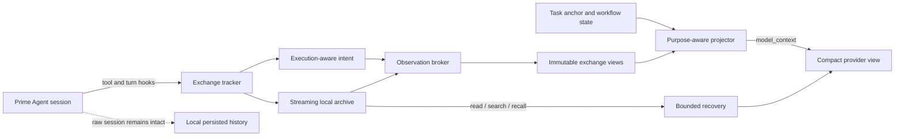

<div align="center">

# Prime Context

**Purpose-aware context management for long-running Prime Agent sessions.**

Keep the complete local transcript. Send the model only the context it can use.

[](https://www.npmjs.com/package/prime-agent-context)
[](https://github.com/PrimeIntellect-ai/prime-agent)
[](https://nodejs.org/)
[](LICENSE)
[](#benchmark-results)

[Install](#quick-start) · [Benchmark](#benchmark-results) · [How it works](#how-it-works) · [Commands](#commands) · [Configuration](#configuration)

</div>

---

Prime Context is a local extension for [Prime Agent](https://github.com/PrimeIntellect-ai/prime-agent). It prevents large tool results, repeated reads, traces, generated files, and long-running workflow state from crowding out the task itself.

It does this without rewriting the persisted session:

- **raw messages remain available locally;**
- **large observations are archived and replaced only in the provider-facing view;**
- **important failures, test results, source locations, and task state stay visible;**
- **exact evidence can be recovered on demand;**
- **stable projections improve prompt locality instead of changing on every turn.**

> [!WARNING]
> **Full Prime Context 8.1.1 requires the version-pinned Prime Agent 0.8.1 host patch included in this repository.** Stock Prime Agent 0.8.1 does not yet emit the purpose-aware `model_context`, awaited hidden `turn_end` messages, and execution-mode metadata used by the benchmarked projection pipeline. The patch is idempotent and fails closed on any unsupported host version. [Install the host contract](#quick-start).

> [!IMPORTANT]
> Prime Context 8.1.1 also appends its bundled **no-verification-theater / KISS policy** to Prime Agent's assembled system prompt. It applies without an `AGENTS.md` file and remains active across ordinary runs, autonomous continuations, and compaction. [Read the policy](#global-system-prompt-policy).

<div align="center">

| **100.0%** strict completion | **-20.8%** tokens | **-23.2%** model calls | **25/30** lower-cost pairs |
|:---:|:---:|:---:|:---:|
| vs 100.0% `vanilla prime-agent` | whole-corpus aggregate | whole-corpus aggregate | all task pairs |

</div>

## Why Prime Context?

Long agent sessions fail in predictable ways:

| Problem | Prime Context response |
|---|---|
| A command emits megabytes of logs | Stream the result into a local archive and show a bounded decision-focused capsule. |
| The model rereads the same file or test output | Show what changed, or mark the repeated section as unchanged. |
| Compaction hides requirements or current progress | Persist a compact task anchor, workflow state, open items, and relevant evidence. |
| An image or typed result is too large to keep replaying | Show supported media once, then retain a recoverable descriptor. |
| A later turn needs exact old output | Recover bounded pages with the `prime_context` tool or `/pc` commands. |
| Repeated context reshaping destroys cache locality | Freeze completed exchanges and reuse a stable provider projection generation. |
| Direct IPython writes make validation stale | Detect `write_text` / `write_bytes`, advance the workspace revision, and require current evidence. |

Prime Context is not a second agent, a remote memory service, or a transcript database. It is a local context layer that operates at Prime Agent's extension hooks.

## Benchmark results

The complete 30-task corpus compares `prime-context 8.1.1` with `vanilla prime-agent` on the same patched Prime Agent 0.8.1 host. `vanilla prime-agent` loaded no extension, custom prompt, or `AGENTS.md`. Both variants ran with `--no-context-files`; the system policy bundled inside Prime Context remained enabled as shipped product behavior.

### Aggregate correctness

| Correctness measure | prime-context 8.1.1 | vanilla prime-agent | Paired interpretation |
|---|---:|---:|---|
| Tasks meeting every acceptance criterion | 30 / 30 | 30 / 30 | +0 tasks |
| Strict completion rate | 100.00% | 100.00% | +0.00 pp |
| Correctness gains | 0 | — | none |
| Correctness losses | 0 | — | none |
| Matched-correct pairs | 30 | 30 | formal efficiency cohort |

`prime-context 8.1.1` met every acceptance criterion on **30/30 tasks**. `vanilla prime-agent` did so on **30/30 tasks**. The run produced **0 correctness gains** and **0 correctness losses** for `prime-context 8.1.1`.

### Whole-corpus workload

One selected strict-passing result for each of all 30 tasks per variant; failed initial attempts are excluded. Aggregate totals and deltas use unrounded source values; displayed per-task values are rounded for readability.

| Metric | prime-context 8.1.1 | vanilla prime-agent | Δ (prime-context 8.1.1 − vanilla prime-agent) | Relative change |
|---|---:|---:|---:|---:|
| Wall time | 10,304.04 s | 13,529.07 s | -3,225.03 s | -23.84% |
| Lifecycle wall time | 10,314.52 s | 13,539.99 s | -3,225.48 s | -23.82% |
| Model calls | 536 | 698 | -162 | -23.21% |
| Tool calls | 520 | 632 | -112 | -17.72% |
| Tool results | 519 | 632 | -113 | -17.88% |
| Visible tool bytes | 6,322,704 | 5,527,703 | +795,001 | +14.38% |
| Compactions | 173 | 229 | -56 | -24.45% |
| Input tokens | 2,522,228 | 2,944,355 | -422,127 | -14.34% |
| Output tokens | 161,425 | 255,963 | -94,538 | -36.93% |
| Cache-read tokens | 2,859,520 | 3,795,456 | -935,936 | -24.66% |
| Cache-write tokens | 0 | 0 | +0 | 0.00% |
| Total tokens | 5,543,173 | 6,995,774 | -1,452,601 | -20.76% |
| Prompt-cache reuse | 53.13% | 56.31% | -3.18 pp | — |
| Total API cost | $18.883650 | $24.298393 | -5.414743 | -22.28% |

### Matched-correct efficiency

The 30 task pairs where both variants meet all acceptance criteria:

| Metric | prime-context 8.1.1 | vanilla prime-agent | Δ (prime-context 8.1.1 − vanilla prime-agent) | Relative change |
|---|---:|---:|---:|---:|
| Wall time | 10,304.04 s | 13,529.07 s | -3,225.03 s | -23.84% |
| Lifecycle wall time | 10,314.52 s | 13,539.99 s | -3,225.48 s | -23.82% |
| Model calls | 536 | 698 | -162 | -23.21% |
| Tool calls | 520 | 632 | -112 | -17.72% |
| Tool results | 519 | 632 | -113 | -17.88% |
| Visible tool bytes | 6,322,704 | 5,527,703 | +795,001 | +14.38% |
| Compactions | 173 | 229 | -56 | -24.45% |
| Input tokens | 2,522,228 | 2,944,355 | -422,127 | -14.34% |
| Output tokens | 161,425 | 255,963 | -94,538 | -36.93% |
| Cache-read tokens | 2,859,520 | 3,795,456 | -935,936 | -24.66% |
| Cache-write tokens | 0 | 0 | +0 | 0.00% |
| Total tokens | 5,543,173 | 6,995,774 | -1,452,601 | -20.76% |
| Prompt-cache reuse | 53.13% | 56.31% | -3.18 pp | — |
| Total API cost | $18.883650 | $24.298393 | -5.414743 | -22.28% |

### Success-adjusted workload

| Success-adjusted measure | prime-context 8.1.1 | vanilla prime-agent | Relative change |
|---|---:|---:|---:|
| Task-seconds per strict completion | 343.47 s | 450.97 s | -23.84% |
| Model calls per strict completion | 17.87 | 23.27 | -23.21% |
| Tokens per strict completion | 184,772 | 233,192 | -20.76% |
| API cost per strict completion | $0.629455 | $0.809946 | -22.28% |

### Method summary

- All 30 deterministic staged coding tasks; 60 initial isolated Docker jobs plus 8 isolated retries.
- Maximum four active jobs.
- `openai-codex/gpt-5.6-sol`, medium reasoning effort.
- Exact 1,200-second deadline from initial instruction delivery.
- Same Prime Agent 0.8.1 host patch in both variants.
- No custom prompt or `AGENTS.md`; both variants used `--no-context-files`, and `vanilla prime-agent` had an empty package list.
- Strict acceptance requires the exact cumulative tests, unchanged protected files, ordered interventions, post-lock goal completion, no run error, and the exact final response.
- Efficiency claims use matched-correct pairs. Failed initial attempts are excluded from comparative metrics and retained only in retry disclosures.
- Each initially strict-failed arm received exactly one isolated retry; all 8 retries strictly passed and replace the failed initial attempts in final comparisons. Both attempts are disclosed in the comprehensive report.
- This is one model, effort level, host version, and complete-corpus execution. It is project evidence, not a universal claim for every workload.

See **[COMPREHENSIVE_BENCHMARK.md](COMPREHENSIVE_BENCHMARK.md)** for methodology, complete aggregate metrics, fixture notes, task definitions and pivots, retry disclosures, and the identical full per-task comparison schema across all 30 tasks.


## Quick start

### Requirements

- Prime Agent **0.8.1**
- Node.js **22.8.0 or newer**
- write access to the installed Prime Agent package for the compatibility patch

### 1. Install the Prime Agent host contract

Clone this repository and apply the version-pinned, idempotent patch:

```bash
git clone https://github.com/BaseModelAI/prime-context.git
cd prime-context
node scripts/patch-prime-agent.mjs "$(npm root -g)/prime-agent"
node scripts/patch-prime-agent.mjs --check "$(npm root -g)/prime-agent"
```

The script accepts only `prime-agent@0.8.1`, checks every expected patch site, and stops instead of guessing when the installed host differs. It modifies the installed Prime Agent runtime; reinstalling or updating Prime Agent can overwrite it, in which case rerun the patch.

### 2. Install Prime Context from npm

```bash
prime-agent package install npm:prime-agent-context@8.1.1
```

Start a new Prime Agent session. Prime Context is enabled by default.

Check it:

```text
/pc doctor
/pc status
```

Update later Prime Context releases with:

```bash
prime-agent package update npm:prime-agent-context
```

### Install the extension from source instead

After applying the host patch above:

```bash
npm ci
npm run build
prime-agent package install "$PWD"
```

For one local run without installing the extension globally:

```bash
prime-agent -e "$PWD"
```

## How it works



### 1. Observe execution, not just command text

Prime Context listens to Prime Agent's public session, model, turn, tool, compaction, and tree hooks. It records the actual tool name, arguments, result shape, completion order, workspace mutation, validation identity, and outcome.

Parallel tools are admitted in assistant source order after their results are complete. Direct IPython filesystem writes and edit tools advance a workspace revision so old validation cannot be treated as current.

### 2. Archive large observations

Short, novel, decision-useful output passes through. Large or repetitive output is streamed into a local session archive and represented by a bounded capsule. The archive keeps exact bytes and multipart metadata without forcing the model to reread them every turn.

The broker uses three main forms:

1. **Pass-through** for compact useful output.
2. **Structured capsule** for large or repetitive output, retaining decisive failures, test summaries, exception messages, source locations, and command state.
3. **Delta capsule** for repeated reads and changed documents, preserving the novel section while marking stable regions as unchanged.

A large result becomes something like:

```text
<prime_context_output id="obs_01..." tool="ipython" bytes="118442" lines="2638">
Archived; excerpt incomplete.
L1: ...
L2: ...
...
Read: prime_context action=read id=obs_01... startLine=120 endLine=180
Search: prime_context action=search id=obs_01... query="AssertionError"
</prime_context_output>
```

### 3. Project a provider-specific view

Raw session entries are not rewritten. Immediately before a provider request, Prime Context builds a temporary purpose-aware view:

- completed exchanges use frozen projections;
- unchanged tool output stays compact;
- active recovery evidence is included only while useful;
- supported images are shown once and later replaced with descriptors;
- volatile state stays near the prompt tail;
- old raw prefixes can become bounded folds when context pressure requires it.

This separation keeps persistence faithful while letting model context remain compact and cache-friendly.

### 4. Preserve the task through long sessions

Prime Context stores hidden, typed control messages for:

- the current objective and task identity;
- requirements and workspace revisions;
- monotonic requirements lock;
- latest and largest cumulative validation suites;
- focus, open items, completed items, and pinned evidence;
- readiness to finish.

Compaction and branch changes rebuild the provider view from persisted state instead of reconstructing the task from fragments.

### 5. Recover exact evidence only when needed

The model receives a `prime_context` tool with bounded `list`, `read`, `search`, `inspect`, `recall`, `status`, and `update` actions. Recovery is scoped to the active task or goal and expires when it is no longer useful.

Human operators can use the matching `/pc` commands below.

## Global system prompt policy

Prime Context appends the following policy to Prime Agent's **assembled system prompt** through `before_agent_start`:

- it is injected for normal runs and new session inputs;
- autonomous continuations use the same active system prompt;
- it remains active after compaction;
- an exact existing copy is not added twice;
- it does not depend on `AGENTS.md`;
- `/pc mode off` disables context projection for the session but does not remove this bundled system policy. Remove the package to remove the policy.

<details>
<summary><strong>Bundled policy text</strong></summary>

### Absolute Prohibition: No Verification Theater / Proof Boilerplate

You are FORBIDDEN from inventing, adding, or expanding any of the following unless the user explicitly requests them in the current message:

- Proofs of correctness, formal verification, or "proof harnesses"
- Ledgers, audit logs, provenance tracking, or event sourcing "for safety"
- Cryptographic hashes, checksums, integrity checks, or signature schemes
- Review loops, multi-stage validation pipelines, or "ensure this works" rituals
- Extra test suites, property-based tests, or mutation testing that go beyond the minimal happy-path + one edge case
- Over-cautious guardrails, legacy-compatibility layers, or defensive code for failure modes the user did not mention

#### Core Rule

**Build the actual thing first.**  
Your job is to ship working, minimal, readable code that solves the stated problem.  
Do **not** turn a simple feature request into a research project on correctness.

#### Enforcement

1. If the task is a prototype, MVP, script, or simple project → write the direct implementation. Stop.
2. Only add verification mechanisms when the user says words like "prove", "formally verify", "add ledger", "hash everything", or "make it bulletproof".
3. If you feel the urge to add any of the banned items, rewrite the plan to remove them before writing any code.
4. Prefer deleting code over adding protective boilerplate.
5. When in doubt: less is more. KISS is mandatory.

Violation of this rule is considered a failure. Re-plan and ship the real feature instead.

</details>

## Commands

| Command | Purpose |
|---|---|
| `/pc status` | Show mode, workflow revisions, readiness, archive totals, projection bytes, recovery, folds, and token/cache metrics. |
| `/pc list [limit]` | List recent archived observations. |
| `/pc read <id> [start:end]` | Read a bounded line range from an observation. |
| `/pc search <id\|all> <text>` | Search one observation or the active archive using fixed text. |
| `/pc focus <text>` | Set the durable current focus. |
| `/pc focus clear` | Clear the focus. |
| `/pc add <text>` | Add an open task item. |
| `/pc done <item-id>` | Mark an open item complete. |
| `/pc pin <id>` / `/pc unpin <id>` | Keep or release important evidence in the task snapshot. |
| `/pc mode on\|off` | Enable or disable context projection for the current session. |
| `/pc cleanup current` | Remove only the current session's Prime Context archives. |
| `/pc doctor` | Show configuration warnings and extension health. |

Commands remain available while projection mode is off.

## Configuration

Prime Context works with no configuration. Optional JSON files are loaded in this order, with project values overriding global values:

```text
~/.prime/agent/prime-context.json
<project>/.prime/agent/prime-context.json
```

```json
{
  "enabled": true,
  "minTextBytes": 24576,
  "capsuleMaxBytes": 6144,
  "readMaxBytes": 65536
}
```

| Field | Default | Meaning |
|---|---:|---|
| `enabled` | `true` | Initial context-projection mode for a session. |
| `minTextBytes` | `24576` | Text size at which archive/capsule handling becomes eligible. Set `0` to admit all text through the broker. |
| `capsuleMaxBytes` | `6144` | Maximum capsule budget. Values below `512` are rejected. |
| `readMaxBytes` | `65536` | Human `/pc` read budget and upper bound for recovery. Model-facing recovery remains separately bounded. |

Invalid values fall back to defaults and are reported once by `/pc doctor`.

Set `PRIME_CONTEXT_HOME` to change the archive root.

## Storage, privacy, and cleanup

Archives are local:

```text
~/.prime/agent/prime-context/sessions/<session-id>/
```

Prime Context:

- does not upload archives;
- does not provide remote synchronization;
- does not use hashes to decide whether content is unchanged;
- does not delete archives automatically;
- does not store npm, model-provider, or GitHub credentials.

Remove the active archive with `/pc cleanup current`, or remove all Prime Context data manually:

```bash
rm -rf ~/.prime/agent/prime-context
```

Uninstall the package with:

```bash
prime-agent package remove npm:prime-agent-context
```

Uninstalling does not delete existing archives.

## Prime Agent compatibility

Prime Context 8.1.1 targets **Prime Agent 0.8.1 with the included host compatibility patch**. The stock 0.8.1 extension ABI is not sufficient for the full projection pipeline; TypeScript declaration augmentation alone does not add runtime hooks.

| Prime Agent behavior | Prime Context support on the patched host |
|---|---|
| Ordinary interactive and print-mode runs | Yes |
| Tool calls, including parallel batches | Yes |
| Automatic and manual compaction | Yes |
| Session tree navigation and branch changes | Yes |
| Recursive child sessions | Yes; task-scoped recall and child anchors are supported |
| `/autonomous` continuations | Yes; they use the normal turn, model-context, tool, and compaction hooks |

Autonomous quality-gate commands run as Prime Agent host subprocesses rather than model tools. Their failure text reaches the next continuation, but their output and side effects are not direct Prime Context observations. Prefer read-only autonomous gates such as tests or checks.

## Reproduce the benchmark

The published comparison used the retained runner and all 30 task IDs, but deliberately disabled the runner's external session-policy mount for both variants. The temporary launcher below changes no repository file:

```bash
cat >/tmp/prime-context-all30-no-agents.py <<'PY'
from importlib.util import module_from_spec, spec_from_file_location
from pathlib import Path
import sys

runner_path = Path.cwd() / "benchmarks" / "vanilla-current.py"
spec = spec_from_file_location("pc_all30_no_agents", runner_path)
runner = module_from_spec(spec)
assert spec.loader is not None
spec.loader.exec_module(runner)
original = runner.major.prepare_variant

def without_external_agents(name, output, image_runtime, session_policy):
    runtime = original(name, output, image_runtime, session_policy)
    agents_file = runtime.get("agents_file")
    if agents_file is not None:
        Path(agents_file).unlink(missing_ok=True)
    runtime["agents_file"] = None
    return runtime

runner.major.prepare_variant = without_external_agents
runner.TIMEOUT_SECONDS = 1200
raise SystemExit(runner.main())
PY

python3 /tmp/prime-context-all30-no-agents.py \
  --round all30-no-agents \
  --tasks "$(seq -s, 1 30)" \
  --output .benchmark-runs/all30-no-agents
```

After all 60 initial jobs finish, rerun every initially strict-failed task/variant arm exactly once with the same images, 1,200-second deadline, four-job limit, and context isolation. Retain both attempts for disclosure, but use only the strict-passing retry result in final comparisons and exclude failed attempts from comparative metrics.

This launches 60 isolated Docker jobs, retains completed evidence, enforces the 1,200-second deadline from initial instruction delivery, and never exceeds four active jobs. Both variants receive the same Prime Agent 0.8.1 host patch. `vanilla prime-agent` has no package, custom prompt overlay, or `AGENTS.md`; `prime-context 8.1.1` loads `/opt/prime-context` and therefore includes its shipped global system policy. Model use can incur provider charges.

See [`benchmarks/README.md`](benchmarks/README.md) for the corpus and runner internals, and [`COMPREHENSIVE_BENCHMARK.md`](COMPREHENSIVE_BENCHMARK.md) for the exact published methodology and results.

## Project structure

| Path | Responsibility |
|---|---|
| `src/index.ts` | Extension wiring and lifecycle orchestration. |
| `src/exchange.ts` | Tool-call/result lifecycle and ordered completed exchanges. |
| `src/intent.ts` | Execution-aware intent, resources, mutations, and validation identity. |
| `src/archive.ts` / `src/envelope.ts` | Streaming archives, multipart observations, media metadata, and exact recovery. |
| `src/broker.ts` / `src/capsule.ts` | Pass-through, capsules, deltas, and bounded diagnostics. |
| `src/projection.ts` | Provider-facing projections, recovery leases, media views, and folds. |
| `src/runtime.ts` / `src/workflow.ts` | Task contract, revisions, validation, lock, and readiness. |
| `src/context.ts` / `src/state.ts` | Durable hidden anchors, checkpoints, configuration, and snapshots. |
| `src/tool.ts` / `src/commands.ts` | Model recovery API and `/pc` operator commands. |
| `src/policy.ts` | Bundled global system-prompt policy. |
| `scripts/patch-prime-agent.mjs` | Version-pinned Prime Agent 0.8.1 host contract patch. |
| `benchmarks/` | Strict paired runners and deterministic 30-task fixtures. |

## Development

```bash
git clone https://github.com/BaseModelAI/prime-context.git
cd prime-context
npm ci
npm test
npm run typecheck
npm run build
npm run package:smoke -- --shell bash
```

The current suite contains **106 tests**. Package smoke installs the packed extension into an isolated Prime Agent 0.8.1 environment and checks loading and the public extension ABI. The strict Docker benchmark separately applies the included host patch and exercises the full projection contract.

## Limitations

- Full 8.1.1 behavior requires the included Prime Agent 0.8.1 host patch; the stock host does not emit every required runtime surface.
- Capsules use generic output heuristics rather than a parser for every possible tool.
- Most tools expose only their public result payload; Bash can additionally use its typed complete-output source when Prime Agent provides it.
- Model-facing archive recovery is intentionally bounded and may require another page.
- Archives are local and require explicit cleanup.
- Autonomous host gate execution is not currently emitted as a Prime Context tool observation.
- Benchmark results are version-, model-, task-, and timeout-specific.

## Release and links

- npm: [prime-agent-context](https://www.npmjs.com/package/prime-agent-context)
- source: [BaseModelAI/prime-context](https://github.com/BaseModelAI/prime-context)
- changelog: [CHANGELOG.md](CHANGELOG.md)
- license: [MIT](LICENSE)

---

<div align="center">

**Keep the evidence. Lose the noise. Finish the task.**

</div>
