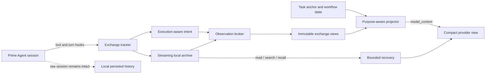

<div align="center">

# Prime Context

**Purpose-aware context management for long-running Prime Agent sessions.**

Keep the complete local transcript. Send the model only the context it can use.

[](https://www.npmjs.com/package/prime-agent-context)
[](https://github.com/PrimeIntellect-ai/prime-agent)
[](https://nodejs.org/)
[](LICENSE)
[](#benchmark-results)

[Install](#quick-start) · [Benchmark](#benchmark-results) · [How it works](#how-it-works) · [Commands](#commands) · [Configuration](#configuration)

</div>

---

Prime Context is a local extension for [Prime Agent](https://github.com/PrimeIntellect-ai/prime-agent). It prevents large tool results, repeated reads, traces, generated files, and long-running workflow state from crowding out the task itself.

It does this without rewriting the persisted session:

- **raw messages remain available locally;**
- **large observations are archived and replaced only in the provider-facing view;**
- **important failures, test results, source locations, and task state stay visible;**
- **exact evidence can be recovered on demand;**
- **stable projections improve prompt locality instead of changing on every turn.**

> [!WARNING]
> **Full Prime Context 8.1.0 requires the version-pinned Prime Agent 0.8.1 host patch included in this repository.** Stock Prime Agent 0.8.1 does not yet emit the purpose-aware `model_context`, awaited hidden `turn_end` messages, and execution-mode metadata used by the benchmarked projection pipeline. The patch is idempotent and fails closed on any unsupported host version. [Install the host contract](#quick-start).

> [!IMPORTANT]
> Prime Context 8.1.0 also appends its bundled **no-verification-theater / KISS policy** to Prime Agent's assembled system prompt. It applies without an `AGENTS.md` file and remains active across ordinary runs, autonomous continuations, and compaction. [Read the policy](#global-system-prompt-policy).

<div align="center">

| **100%** strict completion | **−38.2%** tokens | **−39.9%** model calls | **10/10** lower-cost pairs |
|:---:|:---:|:---:|:---:|
| vs 80% vanilla | all-task aggregate | all-task aggregate | final sampled round |

</div>

## Why Prime Context?

Long agent sessions fail in predictable ways:

| Problem | Prime Context response |
|---|---|
| A command emits megabytes of logs | Stream the result into a local archive and show a bounded decision-focused capsule. |
| The model rereads the same file or test output | Show what changed, or mark the repeated section as unchanged. |
| Compaction hides requirements or current progress | Persist a compact task anchor, workflow state, open items, and relevant evidence. |
| An image or typed result is too large to keep replaying | Show supported media once, then retain a recoverable descriptor. |
| A later turn needs exact old output | Recover bounded pages with the `prime_context` tool or `/pc` commands. |
| Repeated context reshaping destroys cache locality | Freeze completed exchanges and reuse a stable provider projection generation. |
| Direct IPython writes make validation stale | Detect `write_text` / `write_bytes`, advance the workspace revision, and require current evidence. |

Prime Context is not a second agent, a remote memory service, or a transcript database. It is a local context layer that operates at Prime Agent's extension hooks.

## Benchmark results

The final strict campaign compared **Prime Agent 0.8.1 with Prime Context** against the same Prime Agent version without extensions. Both arms inherited the identical Prime Agent host compatibility patch, so the only paired product difference was the Prime Context extension.

### Headline

<div align="center">

| Strict acceptance | Vanilla | Prime Context |
|:---|---:|---:|
| Tasks meeting every acceptance criterion | **8 / 10** | **10 / 10** |
| Correctness gains | — | **2** |
| Correctness losses | — | **0** |

</div>

That is **25% more tasks completed correctly** relative to vanilla, with no Prime Context-only correctness loss in the sample.

Across the eight task pairs where **both** arms met every acceptance criterion:

| Metric | Vanilla | Prime Context | Change |
|---|---:|---:|---:|
| Wall time | 2,473.19 s | 1,947.82 s | **−21.24%** |
| Model calls | 171 | 134 | **−21.64%** |
| Compactions | 44 | 35 | **−20.45%** |
| Total tokens | 1,683,883 | 1,372,816 | **−18.47%** |
| Reported API cost | $5.192214 | $4.285842 | **−17.46%** |
| Tool calls | 137 | 135 | **−1.46%** |
| Weighted cache reuse | 60.92% | 59.40% | −1.52 pp |

Prime Context had lower reported cost in **all 8 matched-correct pairs**. Across all ten tasks, including the two vanilla timeouts, it reduced wall time by **28.73%**, model calls by **39.86%**, compactions by **27.27%**, tokens by **38.24%**, and reported cost by **26.98%**. Cost was lower in **10/10 pairs**.

### Selected task results

| Task | Vanilla | Prime Context | Result |
|---|---:|---:|---|
| `pgm-regions` | Timed out at 600 s; 82 calls; 831,566 tokens | Completed in 309.51 s; 19 calls; 200,384 tokens | Correctness gain; **−75.90% tokens** |
| `union-payroll` | Timed out at 600 s; $1.048442 | Completed in 360.52 s; $0.662580 | Correctness gain; **−36.80% cost** |
| `heat-plate` | 300.40 s; 212,526 tokens | 162.57 s; 117,319 tokens | **−45.88% wall**, **−44.80% tokens** |
| `gear-train` | 344.02 s; $0.662636 | 220.72 s; $0.523912 | Won every reported efficiency metric |

### Direction across independent broad rounds

Three broad 10-task rounds showed the same direction: more strict completions, no Prime Context-only correctness loss, and lower aggregate wall time, calls, compactions, tokens, and cost among matched successes.

| Round | Strict completion, Prime Context / vanilla | Correctness gains / losses | Matched wall | Calls | Compactions | Tokens | Cost |
|---|---:|---:|---:|---:|---:|---:|---:|
| Round 3 | 9/10 / 7/10 | 2 / 0 | −12.39% | −8.82% | −24.44% | −4.13% | −3.87% |
| Round 5, pre-final fix | 10/10 / 8/10 | 2 / 0 | −10.87% | −14.04% | −8.93% | −12.78% | −12.33% |
| **Final Round 6** | **10/10 / 8/10** | **2 / 0** | **−21.24%** | **−21.64%** | **−20.45%** | **−18.47%** | **−17.46%** |

These rounds are not pooled: implementation and harness revisions changed, and some tasks repeated. Round 6 is the release decision; the earlier rounds are directional corroboration.

<details>
<summary><strong>Methodology and caveats</strong></summary>

- Random-without-replacement sample of ten tasks from 28 eligible tasks in the 30-task realistic suite; tasks `11` and `28` were excluded by the immediate-post-fix protocol.
- Seed: `5609401023819199837`.
- Tasks: `5, 7, 27, 19, 8, 22, 23, 14, 9, 4`.
- Tasks `11` and `28` were excluded because they were fixed in the immediately preceding iteration; they were separately replayed before the independent final round.
- Alternating paired vanilla/current queue in isolated Docker environments.
- Maximum four active jobs.
- Exact 600-second deadline measured from the initial instruction.
- `openai-codex/gpt-5.6-sol`, medium reasoning effort.
- The same host compatibility patch was installed in vanilla and current; vanilla loaded no Prime Context extension.
- “Strict acceptance” required the full staged protocol, expected tests, completed goal, exact final response, protected files unchanged, and no run error—not merely a passing test command.
- Efficiency totals use matched-correct pairs unless explicitly marked “all ten tasks.”
- This is one model, one effort level, one seed, and one ten-task sample. It is strong project evidence, not a universal statistical claim about every model or workload.
- Prime Context was slightly slower on two matched-correct tasks because of provider compaction-summary timing; both still used fewer calls, fewer tokens, and lower cost. One task used more tokens while remaining faster, cheaper, and requiring fewer compactions.

</details>

The repository includes the deterministic task fixtures and benchmark implementation under [`benchmarks/`](benchmarks/). The public numbers above are from the accepted 8.1.0 release candidate.

## Quick start

### Requirements

- Prime Agent **0.8.1**
- Node.js **22.8.0 or newer**
- write access to the installed Prime Agent package for the compatibility patch

### 1. Install the Prime Agent host contract

Clone this repository and apply the version-pinned, idempotent patch:

```bash
git clone https://github.com/BaseModelAI/prime-context.git
cd prime-context
node scripts/patch-prime-agent.mjs "$(npm root -g)/prime-agent"
node scripts/patch-prime-agent.mjs --check "$(npm root -g)/prime-agent"
```

The script accepts only `prime-agent@0.8.1`, checks every expected patch site, and stops instead of guessing when the installed host differs. It modifies the installed Prime Agent runtime; reinstalling or updating Prime Agent can overwrite it, in which case rerun the patch.

### 2. Install Prime Context from npm

```bash
prime-agent package install npm:prime-agent-context@8.1.0
```

Start a new Prime Agent session. Prime Context is enabled by default.

Check it:

```text
/pc doctor
/pc status
```

Update later Prime Context releases with:

```bash
prime-agent package update npm:prime-agent-context
```

### Install the extension from source instead

After applying the host patch above:

```bash
npm ci
npm run build
prime-agent package install "$PWD"
```

For one local run without installing the extension globally:

```bash
prime-agent -e "$PWD"
```

## How it works



### 1. Observe execution, not just command text

Prime Context listens to Prime Agent's public session, model, turn, tool, compaction, and tree hooks. It records the actual tool name, arguments, result shape, completion order, workspace mutation, validation identity, and outcome.

Parallel tools are admitted in assistant source order after their results are complete. Direct IPython filesystem writes and edit tools advance a workspace revision so old validation cannot be treated as current.

### 2. Archive large observations

Short, novel, decision-useful output passes through. Large or repetitive output is streamed into a local session archive and represented by a bounded capsule. The archive keeps exact bytes and multipart metadata without forcing the model to reread them every turn.

The broker uses three main forms:

1. **Pass-through** for compact useful output.
2. **Structured capsule** for large or repetitive output, retaining decisive failures, test summaries, exception messages, source locations, and command state.
3. **Delta capsule** for repeated reads and changed documents, preserving the novel section while marking stable regions as unchanged.

A large result becomes something like:

```text
<prime_context_output id="obs_01..." tool="ipython" bytes="118442" lines="2638">
Archived; excerpt incomplete.
L1: ...
L2: ...
...
Read: prime_context action=read id=obs_01... startLine=120 endLine=180
Search: prime_context action=search id=obs_01... query="AssertionError"
</prime_context_output>
```

### 3. Project a provider-specific view

Raw session entries are not rewritten. Immediately before a provider request, Prime Context builds a temporary purpose-aware view:

- completed exchanges use frozen projections;
- unchanged tool output stays compact;
- active recovery evidence is included only while useful;
- supported images are shown once and later replaced with descriptors;
- volatile state stays near the prompt tail;
- old raw prefixes can become bounded folds when context pressure requires it.

This separation keeps persistence faithful while letting model context remain compact and cache-friendly.

### 4. Preserve the task through long sessions

Prime Context stores hidden, typed control messages for:

- the current objective and task identity;
- requirements and workspace revisions;
- monotonic requirements lock;
- latest and largest cumulative validation suites;
- focus, open items, completed items, and pinned evidence;
- readiness to finish.

Compaction and branch changes rebuild the provider view from persisted state instead of reconstructing the task from fragments.

### 5. Recover exact evidence only when needed

The model receives a `prime_context` tool with bounded `list`, `read`, `search`, `inspect`, `recall`, `status`, and `update` actions. Recovery is scoped to the active task or goal and expires when it is no longer useful.

Human operators can use the matching `/pc` commands below.

## Global system prompt policy

Prime Context appends the following policy to Prime Agent's **assembled system prompt** through `before_agent_start`:

- it is injected for normal runs and new session inputs;
- autonomous continuations use the same active system prompt;
- it remains active after compaction;
- an exact existing copy is not added twice;
- it does not depend on `AGENTS.md`;
- `/pc mode off` disables context projection for the session but does not remove this bundled system policy. Remove the package to remove the policy.

<details>
<summary><strong>Bundled policy text</strong></summary>

### Absolute Prohibition: No Verification Theater / Proof Boilerplate

You are FORBIDDEN from inventing, adding, or expanding any of the following unless the user explicitly requests them in the current message:

- Proofs of correctness, formal verification, or "proof harnesses"
- Ledgers, audit logs, provenance tracking, or event sourcing "for safety"
- Cryptographic hashes, checksums, integrity checks, or signature schemes
- Review loops, multi-stage validation pipelines, or "ensure this works" rituals
- Extra test suites, property-based tests, or mutation testing that go beyond the minimal happy-path + one edge case
- Over-cautious guardrails, legacy-compatibility layers, or defensive code for failure modes the user did not mention

#### Core Rule

**Build the actual thing first.**  
Your job is to ship working, minimal, readable code that solves the stated problem.  
Do **not** turn a simple feature request into a research project on correctness.

#### Enforcement

1. If the task is a prototype, MVP, script, or simple project → write the direct implementation. Stop.
2. Only add verification mechanisms when the user says words like "prove", "formally verify", "add ledger", "hash everything", or "make it bulletproof".
3. If you feel the urge to add any of the banned items, rewrite the plan to remove them before writing any code.
4. Prefer deleting code over adding protective boilerplate.
5. When in doubt: less is more. KISS is mandatory.

Violation of this rule is considered a failure. Re-plan and ship the real feature instead.

</details>

## Commands

| Command | Purpose |
|---|---|
| `/pc status` | Show mode, workflow revisions, readiness, archive totals, projection bytes, recovery, folds, and token/cache metrics. |
| `/pc list [limit]` | List recent archived observations. |
| `/pc read <id> [start:end]` | Read a bounded line range from an observation. |
| `/pc search <id\|all> <text>` | Search one observation or the active archive using fixed text. |
| `/pc focus <text>` | Set the durable current focus. |
| `/pc focus clear` | Clear the focus. |
| `/pc add <text>` | Add an open task item. |
| `/pc done <item-id>` | Mark an open item complete. |
| `/pc pin <id>` / `/pc unpin <id>` | Keep or release important evidence in the task snapshot. |
| `/pc mode on\|off` | Enable or disable context projection for the current session. |
| `/pc cleanup current` | Remove only the current session's Prime Context archives. |
| `/pc doctor` | Show configuration warnings and extension health. |

Commands remain available while projection mode is off.

## Configuration

Prime Context works with no configuration. Optional JSON files are loaded in this order, with project values overriding global values:

```text
~/.prime/agent/prime-context.json
<project>/.prime/agent/prime-context.json
```

```json
{
  "enabled": true,
  "minTextBytes": 24576,
  "capsuleMaxBytes": 6144,
  "readMaxBytes": 65536
}
```

| Field | Default | Meaning |
|---|---:|---|
| `enabled` | `true` | Initial context-projection mode for a session. |
| `minTextBytes` | `24576` | Text size at which archive/capsule handling becomes eligible. Set `0` to admit all text through the broker. |
| `capsuleMaxBytes` | `6144` | Maximum capsule budget. Values below `512` are rejected. |
| `readMaxBytes` | `65536` | Human `/pc` read budget and upper bound for recovery. Model-facing recovery remains separately bounded. |

Invalid values fall back to defaults and are reported once by `/pc doctor`.

Set `PRIME_CONTEXT_HOME` to change the archive root.

## Storage, privacy, and cleanup

Archives are local:

```text
~/.prime/agent/prime-context/sessions/<session-id>/
```

Prime Context:

- does not upload archives;
- does not provide remote synchronization;
- does not use hashes to decide whether content is unchanged;
- does not delete archives automatically;
- does not store npm, model-provider, or GitHub credentials.

Remove the active archive with `/pc cleanup current`, or remove all Prime Context data manually:

```bash
rm -rf ~/.prime/agent/prime-context
```

Uninstall the package with:

```bash
prime-agent package remove npm:prime-agent-context
```

Uninstalling does not delete existing archives.

## Prime Agent compatibility

Prime Context 8.1.0 targets **Prime Agent 0.8.1 with the included host compatibility patch**. The stock 0.8.1 extension ABI is not sufficient for the full projection pipeline; TypeScript declaration augmentation alone does not add runtime hooks.

| Prime Agent behavior | Prime Context support on the patched host |
|---|---|
| Ordinary interactive and print-mode runs | Yes |
| Tool calls, including parallel batches | Yes |
| Automatic and manual compaction | Yes |
| Session tree navigation and branch changes | Yes |
| Recursive child sessions | Yes; task-scoped recall and child anchors are supported |
| `/autonomous` continuations | Yes; they use the normal turn, model-context, tool, and compaction hooks |

Autonomous quality-gate commands run as Prime Agent host subprocesses rather than model tools. Their failure text reaches the next continuation, but their output and side effects are not direct Prime Context observations. Prefer read-only autonomous gates such as tests or checks.

## Reproduce the benchmark

The strict paired runner requires Docker, Prime Agent authentication, and model access. A fresh run intentionally omits both `--tasks` and `--seed`:

```bash
uv run python benchmarks/vanilla-current.py \
  --round public-reproduction \
  --output .benchmark-runs/public-reproduction
```

Replay the accepted final sample with:

```bash
uv run python benchmarks/vanilla-current.py \
  --round release-8.1.0-replay \
  --seed 5609401023819199837 \
  --exclude-tasks 11,28 \
  --output .benchmark-runs/release-8.1.0-replay
```

The runner creates isolated arm containers, uses the alternating paired queue, enforces the exact 600-second deadline and four-job cap, and retains completed containers until inspection. Model use can incur provider charges. See [`benchmarks/README.md`](benchmarks/README.md) for task and metric details.

## Project structure

| Path | Responsibility |
|---|---|
| `src/index.ts` | Extension wiring and lifecycle orchestration. |
| `src/exchange.ts` | Tool-call/result lifecycle and ordered completed exchanges. |
| `src/intent.ts` | Execution-aware intent, resources, mutations, and validation identity. |
| `src/archive.ts` / `src/envelope.ts` | Streaming archives, multipart observations, media metadata, and exact recovery. |
| `src/broker.ts` / `src/capsule.ts` | Pass-through, capsules, deltas, and bounded diagnostics. |
| `src/projection.ts` | Provider-facing projections, recovery leases, media views, and folds. |
| `src/runtime.ts` / `src/workflow.ts` | Task contract, revisions, validation, lock, and readiness. |
| `src/context.ts` / `src/state.ts` | Durable hidden anchors, checkpoints, configuration, and snapshots. |
| `src/tool.ts` / `src/commands.ts` | Model recovery API and `/pc` operator commands. |
| `src/policy.ts` | Bundled global system-prompt policy. |
| `scripts/patch-prime-agent.mjs` | Version-pinned Prime Agent 0.8.1 host contract patch. |
| `benchmarks/` | Strict paired runners and deterministic 30-task fixtures. |

## Development

```bash
git clone https://github.com/BaseModelAI/prime-context.git
cd prime-context
npm ci
npm test
npm run typecheck
npm run build
npm run package:smoke -- --shell bash
```

The current suite contains **106 tests**. Package smoke installs the packed extension into an isolated Prime Agent 0.8.1 environment and checks loading and the public extension ABI. The strict Docker benchmark separately applies the included host patch and exercises the full projection contract.

## Limitations

- Full 8.1.0 behavior requires the included Prime Agent 0.8.1 host patch; the stock host does not emit every required runtime surface.
- Capsules use generic output heuristics rather than a parser for every possible tool.
- Most tools expose only their public result payload; Bash can additionally use its typed complete-output source when Prime Agent provides it.
- Model-facing archive recovery is intentionally bounded and may require another page.
- Archives are local and require explicit cleanup.
- Autonomous host gate execution is not currently emitted as a Prime Context tool observation.
- Benchmark results are version-, model-, task-, and timeout-specific.

## Release and links

- npm: [prime-agent-context](https://www.npmjs.com/package/prime-agent-context)
- source: [BaseModelAI/prime-context](https://github.com/BaseModelAI/prime-context)
- changelog: [CHANGELOG.md](CHANGELOG.md)
- license: [MIT](LICENSE)

---

<div align="center">

**Keep the evidence. Lose the noise. Finish the task.**

</div>
