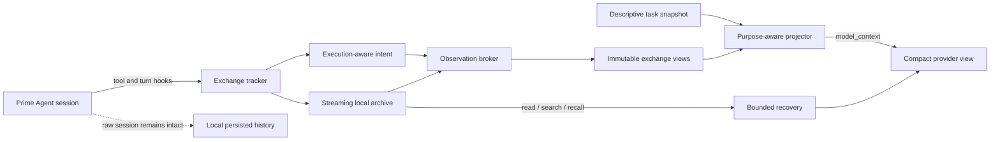

<div align="center">

# Prime Context

## **30/30. Faster every time. Cheaper every time.**

**The purpose-aware context engine that turns Prime Agent into a long-horizon wrecking ball.**

Keep the exact local evidence. Strip the repeated noise. Preserve the objective. Finish the job.

[](https://www.npmjs.com/package/prime-agent-context)
[](https://github.com/PrimeIntellect-ai/prime-agent)
[](https://nodejs.org/)
[](LICENSE)

[Install](#install-exact-steps) · [See the advantage](#what-prime-context-adds) · [Read every benchmark](BENCHMARKS.md) · [Changelog](CHANGELOG.md)

</div>

---

Prime Agent already has the tools. Prime Context gives it the **memory discipline, evidence control, and task continuity** to use those tools for hours without drowning in its own transcript.

This is not a chat-summary wrapper. It is a branch-aware, purpose-aware local context runtime for [Prime Agent](https://github.com/PrimeIntellect-ai/prime-agent). It observes complete tool exchanges, archives exact evidence, projects a stable working set for each model request, and lets the agent recover the original bytes when it needs them.

The raw session remains local and intact. The model sees the part that can move the task forward.

> [!IMPORTANT]
> Prime Context 9.2.0 requires **Prime Agent 0.9.1** and the included, version-pinned host patch. Install Prime Agent first, install Prime Context second, then run the three patch commands exactly as shown below.

> [!WARNING]
> The host patch is required. Prime Agent's public extension ABI does not expose every finalized-exchange, projection, compaction, usage, and continuation surface Prime Context needs. The patcher accepts only the exact 0.9.1 contract, validates all transformations before writing, is idempotent, and fails instead of guessing.

## The scoreboard

| Result | Prime Context | Vanilla Prime Agent 0.9.1 |
|---|---:|---:|
| Strict task completion | **30/30** | 29/30 |
| Faster on strict both-pass pairs | **29/29** | 0/29 |
| Cheaper on strict both-pass pairs | **29/29** | 0/29 |
| Comparable agent time | **5,665.556 s** | 7,051.335 s |
| Comparable billed API cost | **$11.898793** | $16.852171 |
| Comparable provider tokens | **3,627,683** | 5,997,405 |

That is **19.65% less agent time**, **29.39% less billed cost**, and **39.51% fewer provider tokens** across the 29 tasks both systems strictly passed. Prime Context also won correctness on Task 30 after vanilla failed both allowed attempts.

These headline sweep claims compare Prime Context with stock Prime Agent 0.9.1. A separately run pure vanilla Codex CLI baseline is reported in [the benchmark section](#the-completed-30-task-benchmark) and the detailed record.

**Twenty-nine strict head-to-heads. Twenty-nine time wins. Twenty-nine cost wins. That is not a cherry-picked average. It is a sweep.**

The recorded current arm used npm-installed `prime-agent-context@9.1.1` plus the release-candidate host patch. Version 9.2.0 ships that work together with the newly audited goal-state projection and error-surface improvements. No repository checkout was loaded by the benchmark. See [BENCHMARKS.md](BENCHMARKS.md) for methodology, all 30 task descriptions, every selected metric, all retained retries, and the evidence map.

## What Prime Context adds

| Capability | Vanilla Prime Agent 0.9.1 | Prime Context 9.2.0 |
|---|---|---|
| Model working context | Normal conversation history and host compaction | Purpose-aware projections for provider calls, compaction, branch summaries, and refinement |
| Source of truth | Model context and persisted history are closely coupled | Raw local session history stays intact while the model receives a separate bounded working set |
| Large tool results | Can dominate later prompts | Exact multipart archive plus compact structured capsules and direct recovery refs |
| Repeated reads and logs | Repeated bytes return to the prompt | Stable pass-through, delta capsules, and explicit unchanged-region markers |
| Tool understanding | General tool-call transcript | Execution-aware intent, resources, mutations, validation identity, failures, and ordered finalized exchanges |
| Long-task continuity | Relies on the active transcript | Branch-scoped objective, constraints, focus, revisions, diagnostics, open work, and durable task anchors |
| Goal state | Repeated continuation messages accumulate | *NEW* — one self-contained latest goal state replaces stale text-only repetitions |
| Persistent goal polling | Unchanged watchers can re-prompt at machine speed | *NEW* — interruptible 15/30/60/120/180-second host backoff for unchanged read-only watchers |
| Watcher transcript | Every successful poll remains model-facing | *NEW* — older identical read-only IPython and Bash polls fold into one bounded summary while recent complete exchanges remain |
| Recovery failures and external listing | Some unsupported scope paths can look success-shaped | *NEW* — real tool errors propagate as errors; parent/project listing is rejected with exact-recall guidance |
| Exact recovery | No Prime Context observation index | Pageable `read`, `inspect`, `search`, and exact `recall` over current, session, parent, and project evidence |
| Media | Images can stay expensive across turns | Exact media archive, bounded recovery, stable placeholders, and controlled re-showing |
| Recursive work | Child sessions have their own context | Direct-parent recall, exact-cwd project recall, fork import, child anchors, and descendant accounting |
| Native knowledge | Host skills only | Frozen, validated, budgeted pattern and skill routing plus explicit `/pc learn` |
| Optional auxiliary work | No Prime Context broker | Utility-gated task scouting, semantic distillation, stall recovery, and one-shot knowledge compilation |
| Operator visibility | Host diagnostics | `/pc status`, `/pc task`, `/pc observations`, `/pc show`, `/pc doctor`, `/pc cleanup`, and more |
| System policy | Project prompt only | Bundled global no-verification-theater / KISS policy, including after compaction and autonomous continuation |
| Host integration | Stock ABI | Explicit, inspectable, exact-version patch; no hidden `postinstall` mutation |

## Why Prime Context?

Long agent sessions fail in predictable ways:

| Failure mode | Prime Context response |
|---|---|
| A command emits thousands of lines | Archive the exact result and show a bounded capsule with decisive failures and summaries. |
| The model rereads the same file or test output | Show what changed, or mark the repeated section as unchanged. |
| Tool-heavy work pushes out the original request | Restore a small durable task anchor and sparse current state. |
| Compaction changes the model's view | Use the same projection rules for provider calls and compaction. |
| A later turn needs exact old output | Recover bounded pages with the `prime_context` tool or `/pc` commands. |
| Parallel tools finish out of order | Finalize complete exchanges in assistant source order. |
| A watcher keeps saying “still running” | Back off at the host and fold stale successful polls without hiding failures or terminal state. |

## Install: exact steps

### Requirements

- Linux or macOS with Bash or Zsh
- Node.js **22.8.0 or newer**
- npm
- write access to your active npm global prefix
- provider credentials already supported by Prime Agent

Do not mix Node installations or npm prefixes during these steps. Confirm that `node`, `npm`, and the installed `prime-agent` resolve from the same active Node environment.

### 1. Install Prime Agent 0.9.1 first

Prime Agent 0.9.1 is distributed through its upstream GitHub release tarball. Matching registry packages are not available. npm identifies that dependency by the exact tarball URL, so the one-command `allowScripts` policy must include the URL itself:

```bash
PRIME_AGENT_TARBALL='https://github.com/PrimeIntellect-ai/prime-agent/releases/download/v0.9.1/prime-agent-0.9.1.tgz'
NPM_CONFIG_ALLOW_SCRIPTS="$PRIME_AGENT_TARBALL,@google/genai,koffi,protobufjs" \
  npm install --global "$PRIME_AGENT_TARBALL"

prime-agent --version
```

The last command must print:

```text
0.9.1
```

The environment policy applies only to that npm command. It does not change your user npm configuration.

### 2. Install Prime Context 9.2.0

Use Prime Agent's package manager. Keep the same exact `allowScripts` URL because Prime Context pins the same upstream runtime packages:

```bash
PRIME_AGENT_TARBALL='https://github.com/PrimeIntellect-ai/prime-agent/releases/download/v0.9.1/prime-agent-0.9.1.tgz'
NPM_CONFIG_ALLOW_SCRIPTS="$PRIME_AGENT_TARBALL,@google/genai,koffi,protobufjs" \
  prime-agent package install npm:prime-agent-context@9.2.0

prime-agent package list
command -v prime-context-patch-agent
```

`prime-agent package list` must include `npm:prime-agent-context@9.2.0`. The final command must print the installed patcher's path.

### 3. Apply every required Prime Agent patch

Run all three commands. Do not skip the stock check or the final check:

```bash
PRIME_AGENT_ROOT="$(npm root --global)/prime-agent"
node -p "require(process.argv[1]).version" "$PRIME_AGENT_ROOT/package.json"

prime-context-patch-agent --check-stock "$PRIME_AGENT_ROOT"
prime-context-patch-agent "$PRIME_AGENT_ROOT"
prime-context-patch-agent --check "$PRIME_AGENT_ROOT"
```

The version command must print `0.9.1`. The final command must report that the Prime Context host contract is installed.

The patcher covers the complete host contract required by this release, including:

- authoritative finalized tool exchanges and exact message-to-entry references;
- awaited hidden `turn_end` messages and purpose-aware `model_context` projection;
- provider, compaction, branch-summary, refinement, usage, and recursive-session plumbing;
- Prime Context package discovery and execution behavior in the bundled host;
- *NEW* interruptible persistent-goal watcher backoff in modular and bundled runtime paths.

The patch does **not** run in `postinstall`. Nothing silently edits Prime Agent. Reinstalling or updating Prime Agent replaces the patched files; after any reinstall, run the three commands again.

### 4. Start Prime Agent

```bash
prime-agent
```

Inside the session:

```text
/pc doctor
/pc status
```

Prime Context is enabled by default. `/pc doctor` should identify Prime Agent 0.9.1 and report no host-contract error.

### Upgrade an existing 9.1.x installation

Pinned Prime Agent package sources are not advanced by `prime-agent package update`. Replace the configured package explicitly, then upgrade the host contract:

```bash
prime-agent package remove npm:prime-agent-context

PRIME_AGENT_TARBALL='https://github.com/PrimeIntellect-ai/prime-agent/releases/download/v0.9.1/prime-agent-0.9.1.tgz'
NPM_CONFIG_ALLOW_SCRIPTS="$PRIME_AGENT_TARBALL,@google/genai,koffi,protobufjs" \
  prime-agent package install npm:prime-agent-context@9.2.0

PRIME_AGENT_ROOT="$(npm root --global)/prime-agent"
prime-context-patch-agent "$PRIME_AGENT_ROOT"
prime-context-patch-agent --check "$PRIME_AGENT_ROOT"
```

Do not run `--check-stock` on an already patched host. Use it after a fresh Prime Agent install; use the idempotent apply-plus-check pair for an upgrade.

### Install Prime Context from source instead

Install Prime Agent 0.9.1 with step 1 first. Then:

```bash
git clone https://github.com/BaseModelAI/prime-context.git
cd prime-context

PRIME_AGENT_TARBALL='https://github.com/PrimeIntellect-ai/prime-agent/releases/download/v0.9.1/prime-agent-0.9.1.tgz'
NPM_CONFIG_ALLOW_SCRIPTS="$PRIME_AGENT_TARBALL,@google/genai,koffi,protobufjs" npm ci
npm run build
prime-agent package install "$PWD"

PRIME_AGENT_ROOT="$(npm root --global)/prime-agent"
node scripts/patch-prime-agent.mjs --check-stock "$PRIME_AGENT_ROOT"
node scripts/patch-prime-agent.mjs "$PRIME_AGENT_ROOT"
node scripts/patch-prime-agent.mjs --check "$PRIME_AGENT_ROOT"
```

A local source registration does not globally link the packaged command, so the source flow invokes the repository script directly. For one run without registering the extension, use `prime-agent -e "$PWD"` after the host patch is installed.

## How it works



### 1. Observe execution, not just command text

Prime Context listens to Prime Agent's public session, model, turn, tool, compaction, and tree hooks. It records the actual tool name, arguments, result shape, completion order, workspace mutation, validation identity, and outcome.

Parallel tools are admitted in assistant source order after their results are complete. Direct persistent-REPL filesystem writes, native `bash()` mutations, and edit tools advance a workspace revision so old validation cannot be treated as current.

### 2. Archive large observations

Short, novel, decision-useful output passes through. Large or repetitive output is streamed into a local session archive and represented by a bounded capsule. The archive keeps exact bytes and multipart metadata without forcing the model to reread them every turn.

The broker uses three main forms:

1. **Pass-through** for compact useful output.
2. **Structured capsule** for large or repetitive output, retaining decisive failures, test summaries, exception messages, source locations, and command state.
3. **Delta capsule** for repeated reads and changed documents, preserving the novel section while marking stable regions as unchanged.

A large result becomes something like:

```text
<prime_context_output id="obs_01..." tool="ipython" bytes="118442" lines="2638">
Archived; excerpt incomplete.
L1: ...
L2: ...
...
Read: prime_context action=read id=obs_01... startLine=120 endLine=180
Search: prime_context action=search id=obs_01... query="AssertionError"
</prime_context_output>
```

### 3. Project a provider-specific view

Raw session entries are not rewritten. Immediately before a provider request, Prime Context builds a temporary purpose-aware view:

- finalized exchanges use one installed fixed view;
- unchanged entry prefixes reuse the same projection only within the same semantic epoch;
- recovered text and supported images remain literal persistent evidence;
- sparse task updates stay near the prompt tail;
- Prime Agent owns compaction summaries and tree summaries;
- the patched host caches the next-request total across the effective system prompt, active tools, and the identical `budget` projection.

This separation keeps persistence faithful while letting model context remain compact and cache-friendly. Prime Context does not generate lossy history folds.

### 4. Preserve the task through long sessions

Prime Context stores a bounded descriptive `TaskSnapshotV2` with:

- the current objective and task identity;
- explicit user constraints;
- the current focus and open items;
- pinned evidence and actionable observations;
- concrete artifact paths.

The snapshot records facts. It does not infer completion, readiness, gates, or a prescriptive plan. Compaction and branch changes rebuild the provider view from persisted state instead of reconstructing the task from fragments.

### 5. Recover exact evidence only when needed

The model receives a `prime_context` tool with bounded `list`, `read`, `search`, `inspect`, `recall`, `status`, and `update` actions. Recovery is scoped to the active task or goal. Returned text and images are direct message content, so later turns can use the evidence without a transient lease.

Human operators can use the matching `/pc` commands below.

### 6. Route native skills and optional auxiliary work

Prime Agent discovers `<libraryPath>/skills` as native skills. At `session_start`, Prime Context also loads one frozen routing catalog from the same configured library. Deterministic high-confidence matches inject at most two already-loaded procedures and make no model call. Ambiguous or genuinely complex starts can request one utility-gated scout completion, and the result is consumed directly by the same system prompt. Rare high-pressure large observations may use one semantic distillation call. A confirmed exact repeat may use one bounded stall-recovery hint; deterministic fallback remains available.

`/pc learn --topic <text> [--from <session-file>]...` compiles bounded selected episodes with one completion. Without `--from` it uses the current selected branch. With `--from` it uses only the named JSONL session files. It can write at most one validated current pair under `patterns/<name>.md` and `skills/<name>/SKILL.md`. With automatic learning enabled, one nonblocking compile is eligible only after authoritative tool feedback plus a strong reuse signal. The active session keeps its frozen catalog; run `/reload` or start a new session to activate the change. There is no retry, repair, review, scoring, or append-only proposal history.

## Global system prompt policy

Prime Context appends the following policy to Prime Agent's **assembled system prompt** through `before_agent_start`:

- it is injected for normal runs and new session inputs;
- autonomous continuations use the same active system prompt;
- it remains active after compaction;
- an exact existing copy is not added twice;
- it does not depend on `AGENTS.md`;
- `/pc mode off` disables context projection for the session but does not remove this bundled system policy. Remove the package to remove the policy.

<details>
<summary><strong>Bundled policy text</strong></summary>

### Absolute Prohibition: No Verification Theater / Proof Boilerplate

You are FORBIDDEN from inventing, adding, or expanding any of the following unless the user explicitly requests them in the current message:

- Proofs of correctness, formal verification, or "proof harnesses"
- Ledgers, audit logs, provenance tracking, or event sourcing "for safety"
- Cryptographic hashes, checksums, integrity checks, or signature schemes
- Review loops, multi-stage validation pipelines, or "ensure this works" rituals
- Extra test suites, property-based tests, or mutation testing that go beyond the minimal happy-path + one edge case
- Over-cautious guardrails, legacy-compatibility layers, or defensive code for failure modes the user did not mention

#### Core Rule

**Build the actual thing first.**  
Your job is to ship working, minimal, readable code that solves the stated problem.  
Do **not** turn a simple feature request into a research project on correctness.

#### Enforcement

1. If the task is a prototype, MVP, script, or simple project → write the direct implementation. Stop.
2. Only add verification mechanisms when the user says words like "prove", "formally verify", "add ledger", "hash everything", or "make it bulletproof".
3. If you feel the urge to add any of the banned items, rewrite the plan to remove them before writing any code.
4. Prefer deleting code over adding protective boilerplate.
5. When in doubt: less is more. KISS is mandatory.

Violation of this rule is considered a failure. Re-plan and ship the real feature instead.

</details>

## Commands

| Command | Purpose |
|---|---|
| `/pc status` | Show mode, task state, archive totals, projection bytes, recovery, and token/cache metrics. |
| `/pc list [limit]` | List recent archived observations. |
| `/pc read <id> [start:end]` | Read a bounded line range from an observation. |
| `/pc search <id\|all> <text>` | Search one observation or the active archive using fixed text. |
| `/pc focus <text>` | Set the durable current focus. |
| `/pc focus clear` | Clear the focus. |
| `/pc add <text>` | Add an open task item. |
| `/pc done <item-id>` | Mark an open item complete. |
| `/pc pin <id>` / `/pc unpin <id>` | Keep or release important evidence in the task snapshot. |
| `/pc mode on\|off` | Enable or disable context projection for the current session. |
| `/pc cleanup current` | Remove only the current session's Prime Context archives. |
| `/pc learn --topic <text> [--from <session-file>]...` | Compile at most one current native pattern/skill pair from this session. |
| `/pc doctor` | Show configuration warnings and extension health. |

Commands remain available while projection mode is off.

## Configuration

Prime Context works with no configuration. Optional JSON files are loaded in this order, with project values overriding global values:

```text
~/.prime/agent/prime-context.json
<project>/.prime/agent/prime-context.json
```

```json
{
  "enabled": true,
  "minTextBytes": 24576,
  "capsuleMaxBytes": 6144,
  "readMaxBytes": 65536,
  "auxiliaryMode": "utility-gated",
  "auxiliaryModel": null,
  "libraryPath": ".prime/agent/prime-context/knowledge",
  "skillBudgetTokens": 800,
  "learningModel": null,
  "autoLearn": "utility-gated"
}
```

| Field | Default | Meaning |
|---|---:|---|
| `enabled` | `true` | Initial context-projection mode for a session. |
| `minTextBytes` | `24576` | Text size at which archive/capsule handling becomes eligible. Set `0` to admit all text through the broker. |
| `capsuleMaxBytes` | `6144` | Maximum capsule budget. Values below `512` are rejected. |
| `readMaxBytes` | `65536` | Human `/pc` read budget and upper bound for recovery. Model-facing recovery remains separately bounded. |
| `auxiliaryMode` | `"utility-gated"` | Permit bounded auxiliary work only when a deterministic utility gate accepts it; use `"off"` for zero auxiliary calls. |
| `auxiliaryModel` | `null` | Optional `provider/model` selector for auxiliary work. `null` uses the current registered model. |
| `libraryPath` | `".prime/agent/prime-context/knowledge"` | Native pattern/skill library, relative to the project unless absolute. |
| `skillBudgetTokens` | `800` | Total deterministic native-skill injection budget. |
| `learningModel` | `null` | Model for `/pc learn`; falls back to `auxiliaryModel`, then the current model. |
| `autoLearn` | `"utility-gated"` | Permit one nonblocking post-task compile only after authoritative tool feedback plus a strong reuse signal; use `"off"` to disable it. |

Invalid values fall back to defaults and are reported once by `/pc doctor`.

Set `PRIME_CONTEXT_HOME` to change the archive root.

## Storage, privacy, and cleanup

Archives are local:

```text
~/.prime/agent/prime-context/sessions/<session-id>/
```

Prime Context:

- does not upload archives;
- does not provide remote synchronization;
- does not use hashes to decide whether content is unchanged;
- does not delete archives automatically;
- does not store npm, model-provider, or GitHub credentials.

Remove the active archive with `/pc cleanup current`, or remove all Prime Context data manually:

```bash
rm -rf ~/.prime/agent/prime-context
```

Uninstall the package with:

```bash
prime-agent package remove npm:prime-agent-context
```

Removing the package does **not** reverse the Prime Agent host patch and does not delete existing archives. The patcher intentionally has no speculative unpatch mode. To restore a stock Prime Agent 0.9.1 host, reinstall the exact upstream tarball after removing Prime Context:

```bash
PRIME_AGENT_TARBALL='https://github.com/PrimeIntellect-ai/prime-agent/releases/download/v0.9.1/prime-agent-0.9.1.tgz'
NPM_CONFIG_ALLOW_SCRIPTS="$PRIME_AGENT_TARBALL,@google/genai,koffi,protobufjs" \
  npm install --global "$PRIME_AGENT_TARBALL"
```

Delete `~/.prime/agent/prime-context` separately only if you also want to erase the local observation archives.

## The completed 30-task benchmark

The release gate used 30 hermetic Python 3.12 workflows with hidden future stages, fresh judge fixtures, loopback-only tool networking, isolated hosts, and a maximum of six concurrent attempts. The two Prime Agent arms used `openai-codex/gpt-5.6-sol` at medium effort.

| Measure | Prime Context | Vanilla 0.9.1 |
|---|---:|---:|
| Strict passes | **30/30** | 29/30 |
| Both-pass time wins | **29/29** | 0/29 |
| Both-pass cost wins | **29/29** | 0/29 |
| Comparable agent time | **5,665.556 s** | 7,051.335 s |
| Comparable billed cost | **$11.898793** | $16.852171 |
| Comparable provider tokens | **3,627,683** | 5,997,405 |

Across the 29 strict both-pass Prime Agent pairs, Prime Context saved **1,385.779 seconds (19.65%)** and **$4.953378 (29.39%)**. Across all selected Prime Agent rows, including vanilla's failed Task 30, Prime Context used 6,172.066 seconds and $13.233338 versus 7,667.468 seconds and $18.513607.

### Supplemental pure vanilla Codex CLI

A separate 2026-09-04 run used stock `codex-cli 0.153.0` with ChatGPT subscription authentication, `gpt-5.6-sol`, medium effort, at most six sessions, no Prime Agent or Prime Context, no custom system/developer prompt, and with no global or local `AGENTS.md` or Codex config file loaded.

| Measure | Pure vanilla Codex CLI |
|---|---:|
| Strict passes | **30/30** |
| Selected agent wall time | 10,338.905 s |
| Actual billed API cost | **N/A** (ChatGPT subscription) |
| Same-rate API equivalent | $31.447008 (diagnostic; not a bill) |
| Provider tokens | 23,327,077 |
| Codex staged turns | 69 |
| Retried tasks | 0 |

Prime Context and Codex both strictly passed all 30 tasks. Across those 30 pairs, Prime Context was faster on **29/30**, used **6,172.066 s** versus **10,338.905 s**, and therefore used **4,166.839 s (40.30%) less agent time**. Codex won Task 13's time comparison. Prime Context used **81.998% fewer diagnostic provider tokens**. The Codex run was independent rather than contemporaneously paired, so these timing figures are supplemental.

Pure Codex also passed Task 30, where stock Prime Agent failed both attempts. On the other 29 tasks both systems strictly passed, stock Prime Agent was faster than Codex on **28/29** and used **24.99% less agent time**; Codex again won Task 13. No billed-cost win or loss is assigned to Codex because the CLI exposes no per-run subscription charge.

Read [BENCHMARKS.md](BENCHMARKS.md) for every task, attempt, check result, timing, billed-cost scope, token diagnostic, retry, isolation detail, and evidence path.

## Prime Agent compatibility

Prime Context 9.2.0 targets **Prime Agent 0.9.1 with the included host compatibility patch**. The stock 0.9.1 extension ABI is not sufficient for the full projection pipeline; TypeScript declaration augmentation alone does not add runtime hooks.

| Prime Agent behavior | Prime Context support on the patched host |
|---|---|
| Ordinary interactive and print-mode runs | Yes |
| Tool calls, including parallel batches | Yes |
| Automatic and manual compaction | Yes |
| Session tree navigation and branch changes | Yes |
| Recursive child sessions | Yes; task-scoped recall and child anchors are supported |
| `/autonomous` continuations | Yes; they use the normal turn, model-context, tool, and compaction hooks |

Autonomous quality-gate commands run as Prime Agent host subprocesses rather than model tools. Their failure text reaches the next continuation, but their output and side effects are not direct Prime Context observations. Prefer read-only autonomous gates such as tests or checks.

## Project structure

| Path | Responsibility |
|---|---|
| `src/index.ts` | Extension wiring and lifecycle orchestration. |
| `src/exchange.ts` | Tool-call/result lifecycle and ordered completed exchanges. |
| `src/intent.ts` | Execution-aware intent, resources, mutations, and validation identity. |
| `src/archive.ts` / `src/envelope.ts` | Streaming archives, multipart observations, media metadata, and exact recovery. |
| `src/broker.ts` / `src/capsule.ts` | Pass-through, capsules, deltas, and bounded diagnostics. |
| `src/projection.ts` | Stable, purpose-aware provider projections and fixed media views. |
| `src/runtime.ts` / `src/workflow.ts` | Branch task selection and canonical progress effects. |
| `src/context.ts` / `src/state.ts` | Sparse descriptive task state, hidden anchors, and configuration. |
| `src/skills.ts` / `src/learn.ts` | Frozen native-skill routing and current-pair compilation. |
| `src/auxiliary.ts` | Bounded utility gating, model resolution, parsers, and one-shot execution. |
| `src/tool.ts` / `src/commands.ts` | Model recovery API and `/pc` operator commands. |
| `src/policy.ts` | Bundled global system-prompt policy. |
| `scripts/patch-prime-agent.mjs` | Version-pinned Prime Agent 0.9.1 host contract patch. |
| `benchmarks/python-realworld-30/` | Published corpus, Prime Agent and pure Codex runners, judges, and benchmark evidence. |

## Development

```bash
git clone https://github.com/BaseModelAI/prime-context.git
cd prime-context
npm ci
npm test
npm run typecheck
npm run build
npm run package:smoke -- --shell bash
```

The current suite contains **110 tests**. Package smoke copies a pristine repository-local or explicit `PRIME_AGENT_ROOT` host into a disposable environment, then checks the packed extension, packaged patcher, and public extension ABI without mutating the source host.

## Limitations

- Full 9.2.0 behavior requires the included Prime Agent 0.9.1 host patch; the stock host does not emit every required runtime surface.
- Capsules use generic output heuristics rather than a parser for every possible tool.
- Most tools expose only their public result payload; Bash can additionally use its typed complete-output source when Prime Agent provides it.
- Model-facing archive recovery is intentionally bounded and may require another page.
- Archives are local and require explicit cleanup.
- Autonomous host gate execution is not currently emitted as a Prime Context tool observation.

## Release and links

- npm: [prime-agent-context](https://www.npmjs.com/package/prime-agent-context)
- source: [BaseModelAI/prime-context](https://github.com/BaseModelAI/prime-context)
- changelog: [CHANGELOG.md](CHANGELOG.md)
- detailed 30-task benchmark: [BENCHMARKS.md](BENCHMARKS.md)
- historical 9.1.0 benchmark: [benchmarks/RELEASE-9.1.0.md](benchmarks/RELEASE-9.1.0.md)
- Prime Agent 0.9.1 migration: [PRIME_AGENT_0.9.1_MIGRATION.md](PRIME_AGENT_0.9.1_MIGRATION.md)
- license: [MIT](LICENSE)

---

<div align="center">

**Thirty tasks entered. Prime Context finished every one. Keep the evidence. Lose the noise. Finish the task.**

</div>
